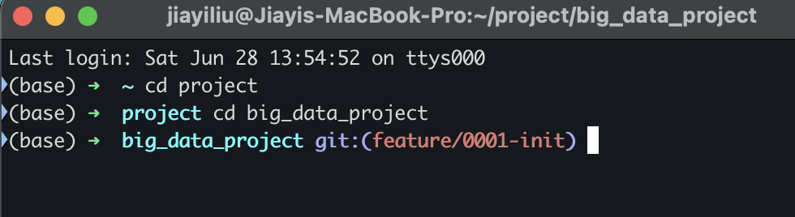

# Table of contents
- 1. Git Commands
- 2. Modifying the README.md File: Example of a Complete Workflow for Synchronizing Local and Remote Projects
- 3. Practical Operations

## 1. Git Commands

`git -h`: Displays help information for Git commands

`git status`: Displays the status of the current working tree.

`ping github.com`: Checks network connectivity

`git clone https://github.com/JiayiLiu07/big_data_project.git`: Clone a remote project

`git branch`: Displays all local branches, with the current branch marked with an asterisk (*). !

`git pull`: Used to fetch and merge the latest content of the current branch from a remote repository. (Remote to local)

`git push`: Used to push updates from the local repository to the remote repository. (Local to remote)

`git checkout xxx`: Switches to the xxx (other) branch

## 2. Modifying the README.md File. Example of a complete process for syncing local to remote:
1. `vim README.md`: Modifies the README.md file
2. `git add`: Adds all changes to the working directory to the staging area.
3. `git status`: Checks the status (confirms changes have been added)
4. `git commit`: The core command for permanently saving code changes. Its function is to record the changes in the current working directory (which have been added to the staging area via git add) to the local repository, with a descriptive commit message for subsequent history tracking. (Save only to the local repository)
5. `git push`: [git push]

## III. Practical Operations

### 1. Upload local files to GitHub

#### Summary: git add -> git commit -> git pull -> git push

##### If I forget one day: Use command+space to enter project: The upload entry is in the project's big_data_project

1. Drag the file I want to upload into big_data_project
2. Type git statue in the terminal to view the status of the current branch: The ✗ symbol usually indicates changes in the workspace
3. Add files to the staging area: git add specifying the folder name or git add .
4. Commit changes to the local repository: git commit -m or git commit
- git log You will see a series of commit records including a commit message.
- git commit -m "Add initial Jupyter notebooks for data analysis" : -m is short for message.
- git commit : This will open a text editor. A template will appear in the editor, allowing you to enter a commit message. After saving and closing the editor, Git will use the entered message to commit the commit.
5. Pull the latest changes from the remote repository: git pull
6. Push the changes to GitHub: git push

### 2. Delete a folder already uploaded to GitHub
1. Use git rm to delete the folder

- -r to recursively delete the folder

- git rm -r data_folder/

2. Commit the deletion

- git commit -m "Remove old data_folder as it's no longer needed"

3. Pull the latest changes from the remote repository

- git pull
4. Push the changes to GitHub

- git push

### 3. Remove .DS_Store from Git tracking and ignore it.

Step 1:

Add .DS_Store to the .gitignore file and add an ignore rule to it.

Step 2:

Remove the .DS_Store file from Git tracking.

git rm --cached .DS_Store

--cached: This only removes the file from the Git index, but does not delete the actual file on the local filesystem.

Commit these changes:

git add .gitignore

git commit -m "Add .DS_Store to .gitignore and untrack it"
Push to the remote repository:

git pull origin feature/0001-init

git push origin feature/0001-init

Full version:

