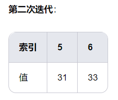

# 1. **Binary Search Algorithm**
**Idea:** Applicable to ordered arrays. Its core idea is to quickly locate the target value by continuously reducing the search range by half.

**Illustration:**

There is an ascending array [10, 14, 19, 26, 27, 31, 33, 35, 42, 44]

The target value is 31.


- left = 0, right = 9, mid = (0 + 9) // 2 = 4.
- array[mid] = 27 < 31, the target value is in the right half, update left = mid + 1 = 5.


- left = 5, right = 9, mid = (5 + 9) // 2 = 7.
- array[mid] = 35 > 31. The target value is in the left half, so update right = mid - 1 = 6.


- left = 5, right = 6, mid = (5 + 6) // 2 = 5.
- array[mid] = 31 == 31. The target value is found, so return index 5.


```python
def binary_search(the_list, target_number):
left=0
right=len(the_list)-1
while right >= left:
# mid = (right-left)/2 + left
mid = (right + left)//2
if the_list[mid]== target_number:
return True
elif the_list[mid] > target_number:
right=the_list[mid]-1
else:
left=the_list[mid]+1
return False
```
# 2. **Linear Search**
**Idea:** Applicable to unordered arrays or linked lists.

**Algorithm steps:**
1. Starting from the first element of the array, check each element one by one to see if it is equal to the target value.
2. If the target value is found, return its index.

If the target value is not found after traversing the entire array, return -1.

**Time Complexity:**
- Worst case: O(n), where n is the length of the array.
- Best case: O(1), if the target value is the first element.
- Average case: O(n).


# 3. **Hash Table Search**

**Idea:** Suitable for scenarios where fast search, insertion, and deletion are required. It uses a hash function to map keys to locations in the table, enabling fast access.

**Time Complexity:**
- Average case: O(1).
- Worst case: O(n), when there are too many hash collisions.


# 4. **BST - Binary Search Tree**


# 5. **Graph Traversal**


