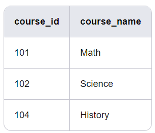
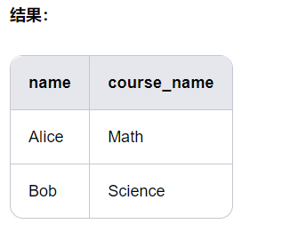
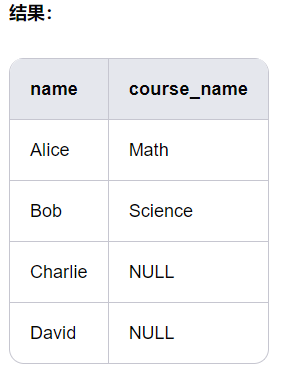
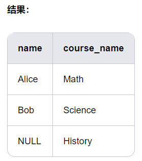
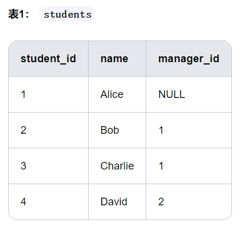
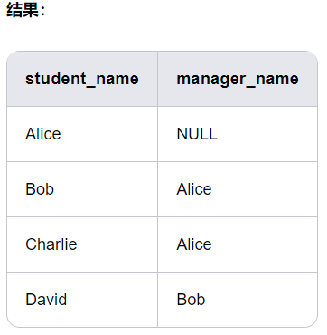

# **SQL_JOIN**

Suppose there are two tables: students and courses, linked by course_id.

Table 1: students


Table 2: courses



1. INNER JOIN: Returns matching rows from both tables. If there are no matches, no rows are returned.
```sql
SELECT students.name, courses.course_name
FROM students
INNER JOIN courses
ON students.course_id = courses.course_id;
```


2. LEFT JOIN: Returns all rows from the left table (table1), even if there are no matching rows in the right table (table2). In this case, rows from the left table are returned, and any columns in the right table are NULL.
```sql
SELECT students.name, courses.course_name
FROM students
LEFT JOIN courses
ON students.course_id = courses.course_id;
```

3. RIGHT JOIN: Returns all rows from the right table (table2). Even if there are no matching rows in the left table (table1), the right table rows are returned, and the left table columns are filled with NULL.
```sql
SELECT students.name, courses.course_name
FROM students
RIGHT JOIN courses
ON students.course_id = courses.course_id;
```


4. FULL OUTER JOIN: Returns all rows from both the left and right tables, regardless of whether there are any matches. Unmatched rows have NULL values filled in the other table's columns. ```sql
SELECT students.name, courses.course_name
FROM students
FULL OUTER JOIN courses
ON students.course_id = courses.course_id;
```


- Returns all rows from both tables, regardless of whether they match.
- Unmatched rows have NULL values filled in the other table's columns.

5. CROSS JOIN: Returns the Cartesian product of two tables, meaning each row from the left table is combined with each row from the right table.
```sql
SELECT students.name, courses.course_name
FROM students
CROSS JOIN courses;
```


- Returns the Cartesian product of two tables, meaning each row from the left table is combined with each row from the right table.
- The total number of rows is the number of rows in the students table multiplied by the number of rows in the courses table.

6. SELF JOIN: Joins a table with itself. This is often used to handle hierarchical or associative relationships within a table.

Suppose the students table has a manager_id column, which represents each student's advisor (advisors are also students).


```sql
SELECT s1.name AS student_name, s2.name AS manager_name
FROM students AS s1
LEFT JOIN students AS s2
ON s1.manager_id = s2.student_id;
```

- s1 represents the student, and s2 represents the advisor.
- Students are associated with their advisors using manager_id.
- If a student has no advisor (e.g., Alice), manager_name is NULL.