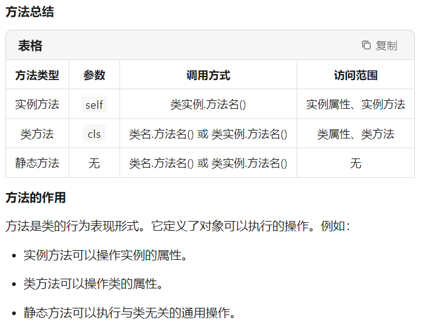

# **Python class and object**

### 1. Class
A class is a code template used to define a group of objects with the same attributes (variables) and methods (functions).

Class definition syntax:
```python
class class name:
def __init__(self, param1, param2, ...): # Constructor
# Initialize attributes
self.attribute1 = param1
self.attribute2 = param2
...

def method name(self, param1, param2, ...):
# Method implementation
...
```
- `class` is the keyword for defining a class.
- `class name` is the name of the class, typically starting with a capital letter.
- `__init__` is a special method, called a constructor, used to initialize the class's attributes.
- `self` is a reference to the current object, used to access the class's attributes and methods.

Example: Define a Student class
```python
class Student:
def __init__(self,id,name,mark):
self.id=id # Define an attribute id
self.name=name # Define an attribute name
self.mark=mark # Define an attribute mark

def show_info(self,id,name,mark): # Define a show_info method
print(f"id:{self.id}")
print(f"name:{self.name}")
print(f"mark:{self.mark}")

def update_mark(self,new_mark): # Define an update_mark method
self.mark=new_mark
```
Example: Define a Person class
```python
class Person:
def __init__(self, name, age):
self.name = name # Define an attribute name
self.age = age # Define an attribute age

def greet(self): # Define a greet method
print(f"Hello, my name is {self.name} and I am {self.age} years old.")
```

### 2. Objects
An object is a specific instance created from a class. The class is the "blueprint," and the object is the "house" built from this blueprint. Each object has its own attribute values but shares the class's methods.

Syntax for creating an object:
```python
object name = class name(param1, param2, ...)
```

Example: Creating an object of the Person class
```python
# Create a Person object
person1 = Person("Alice", 30)

# Accessing object attributes
print(person1.name) # Output: Alice
print(person1.age) # Output: 30

# Calling an object method
person1.greet() # Output: Hello, my name is Alice and I am 30 years old.
```

### 3. Methods
Methods are functions defined within a class. It is similar to a normal function, but with one special feature: the first parameter of a method is usually self, which represents the instance (object) of the class. Through self, the method can access the attributes and other methods of the class.

**(1) Method Type**

In Python, there are mainly the following types of methods:

- Instance Method

- Class Method

- Static Method



**(2) Instance Method**


**(3) Class Method**


**(4) Static Method**

