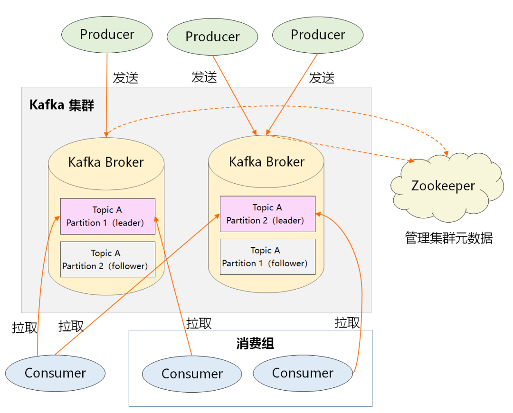

# kafka
>https://kafka1x.apachecn.org/intro.html

## -----↓Optimized Notes↓-----
## 1. What is Kafka used for:
- `Publish and subscribe to streaming records`: Kafka allows users to publish and subscribe to continuous data streams, similar to a message queue or enterprise messaging system.
- In a publish-subscribe messaging system, **messages are persisted in a topic**. Consumers can **subscribe to one or more topics** and consume all the data in that topic. The same data can be consumed by multiple consumers, and data is not immediately deleted after consumption. In a publish-subscribe messaging system, message producers are called publishers, and consumers are called subscribers. An example diagram of this model is as follows: 
- Features: Publish/Subscribe: Topics, repeatable consumption
- `Storing streaming records`: Kafka can store streaming data and has good fault tolerance.
- `Streaming data`: A continuous, real-time sequence of data. This type of data isn't loaded into memory all at once, but arrives continuously, requiring immediate processing and analysis.
- **Stream data is mostly stored in memory**
- `Real-time Data Processing`: Kafka processes data as it's generated, making it suitable for real-time stream data processing.

## 2. What Problems Does Kafka Solve?
- `Data Pipeline Reliability`: Kafka ensures reliable data transmission through its distributed architecture and persistence mechanism.
- `Persistence`: This means storing data on disk.
- `Data Order and Consistency`: Kafka ensures that records are ordered within each partition, and consumers can view records in the order they appear in the log.
- `Scalability`: Kafka's partitioning mechanism allows log scalability and processing of unlimited data.
- `Fault Tolerance`: Kafka ensures fault tolerance by replicating partitions across multiple servers.
- `Real-time Processing Capability`: Kafka processes data as it's generated, supporting real-time stream data processing.

## 3. Challenges of Kafka:
- Operational Complexity: As the cluster scales, operating and maintaining a Kafka cluster can become increasingly complex.
- Resource Management: System resources must be properly allocated and managed to ensure Kafka's performance and stability.
- Security: Data transmission and storage security must be ensured to prevent data leakage or unauthorized access.
- Monitoring and Fault Recovery: Effective monitoring mechanisms and fault recovery strategies are required to address potential system failures.
- Version Compatibility: As Kafka versions are updated, compatibility issues between new and old versions may need to be addressed.

## -----↓ Initial Version Notes↓-----
## 1. What is Kafka?

Kafka is an open-source distributed stream processing platform, originally developed and open-sourced by LinkedIn and now maintained by the Apache Software Foundation. It is primarily used to build high-throughput, low-latency, and scalable real-time data pipelines and streaming applications.

#### ------↓Easy to Understand Version↓------
## 2. Kafka's Message Model

**Summary**: Kafka ensures that messages are not lost and guarantees system reliability through persistent storage of messages.

Persistence: This means storing messages on disk. However, not all messages can be persisted; this is configurable.

**Plain Language**: Kafka is like a super-reliable mailbox. Once messages are stored, they can be found even if the system crashes.

>Why implement persistent message storage?
>To ensure message reliability and system fault tolerance (that is, to ensure that messages are not lost and that the system can recover even if problems occur).

## 3. Solutions to Kafka's Storage Problems

**Summary**: Kafka solves storage scalability and data security issues through distributed storage, message replication, log files, and expiration policies.

**Plain Language**: Kafka is like storing messages in multiple safes, each with multiple replicas. This means you don't have to worry about one failing, and you can even periodically clean up old messages.

## 4. Kafka Overall Architecture

**Summary**: Kafka's architecture consists of multiple components, such as brokers and partitions. Partitions are responsible for message distribution and storage and are the core of the system.

**Plain Language**: Kafka's architecture is like a warehouse with multiple warehouses, each storing different messages. These warehouses are partitioned to improve storage and retrieval efficiency.

#### ------↓Detailed Version↓------

## 5. Kafka Functions

**Message Queuing**: Kafka can be used as a high-performance message queuing system that supports a publish/subscribe model. Producers send messages to a Kafka cluster, and consumers subscribe to and consume messages from the cluster.

**Data Storage**: Kafka persists messages to disk, supporting long-term message storage. It ensures high data availability and fault tolerance through a multi-replication mechanism.

Real-time Stream Processing: Kafka supports real-time data stream processing, enabling rapid data processing and analysis. It provides a stream processing API for complex stream data processing.

## 6. Kafka Architecture
Broker: A Kafka cluster consists of multiple brokers, each of which is an independent server node. Brokers are responsible for storing messages and processing producer and consumer requests.

Topic: A message classification, similar to a table in a database. A topic can be divided into multiple partitions, distributed across different brokers to improve parallel processing capabilities.

Partition: A partition is the physical storage unit of a topic and is an ordered, immutable message queue. Each partition has multiple replicas, including a leader and multiple followers. The leader handles read and write requests, while followers synchronize data.

**Producer**: Producers are responsible for creating messages and delivering them to the Kafka cluster. When delivering messages, they must specify the topic to which the message belongs and determine the partition to which it should be sent.

**Consumer**: Consumers determine which partitions to pull messages from based on the topics they subscribe to and the consumer groups they belong to.

**Zookeeper**: Kafka relies on Zookeeper to manage cluster metadata, such as the number of broker nodes in the cluster and the partitions for each topic.

## 7. Relationship between Kafka and Other Components

**With Hadoop**: Kafka can be integrated with Hadoop to import real-time data streams into Hadoop's storage systems (such as HDFS). Kafka provides high-throughput message queuing, while Hadoop provides powerful data storage and computing capabilities.

**With Flink**: Kafka is a common data source and data sink for Flink. Flink can read real-time data streams from Kafka for processing and write the results back to Kafka. Together, they support real-time stream processing and analysis.