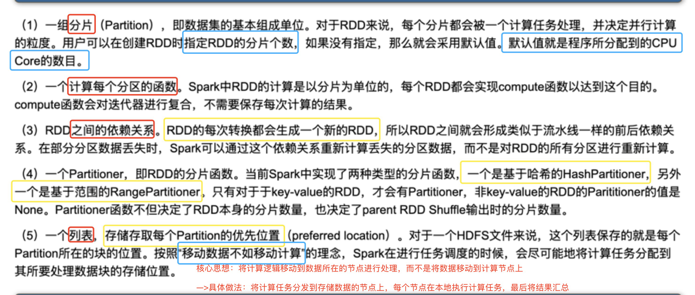

# How to Understand RDDs
>https://www.zhihu.com/tardis/zm/art/91749572?source_id=1005 Spark Theoretical Foundation - RDDs

>https://www.cnblogs.com/qingyunzong/p/8899715.html Spark Learning Path (Part 3) Spark RDDs

1. Properties of RDDs
2. Problems RDDs Solve
3. Advantages of RDDs

## Optimized Notes
### 1. Concept of RDDs
RDDs (Resilient Distributed Datasets) are the most fundamental data abstraction in Spark. They represent an immutable, partitionable collection whose elements can be computed in parallel. RDDs have the characteristics of a data flow model: automatic fault tolerance, locality-aware scheduling, and scalability. RDDs allow users to explicitly cache working sets in memory when executing multiple queries. Subsequent queries can reuse the working set, significantly improving query speed.

- Based on this abstraction, users can perform a series of computations across a cluster without writing intermediate results to disk. -> Reduced overhead
- You can request that data be written to disk (either to disk or not).
- Writing to disk means storing data on disk.
- Overhead: This refers not only to time but also money.
- Hard disks are cheaper than memory (memory is expensive!!!)

- An operator is considered a function (operation).

- RDDs rely on HDFS.
- RDDs can also be independent of HDFS.
- Specifically: Spark and HDFS integrate easily. -> Spark only requires rewriting configuration files and importing the package, without rewriting the source code.
- Spark includes RDDs. -> RDDs can aggregate shards, while HDFS's core function is to chunk data.
- MapReduce has two meanings:
- Concept | The map/reduce functions in Spark are similar to the map/reduce phases in MapReduce. - (As) Engine | Spark was created to replace MapReduce

### 2. RDD Properties

Regarding the above figure, there are several key points:

1. (1) Sharding:

1.1 Supplementary

- Important in blue

- Data can be divided on the hard disk

- RDD sharding is based on time

- RDD partitions themselves are in memory, and RDD is a data type (similar to int, string)

- The number of CPUs and partitions can be different

1.2 HDFS

HDFS mainly interacts with the hard disk

- Physical sharding --> Configuration required: data size must be specified

2. (4) Sharding function

Supplementary: There is also a Round Robin polling

- `Partition`: This is the basic unit of the data set. In Spark, each shard will be processed by a computing task. If the number of shards is not specified, Spark will determine the number based on the number of available CPU cores.
- `Compute function`: In Spark, each RDD (Resilient Distributed Dataset) implements a compute function, which performs computations on each shard. During the computation, there is no need to save the results of each computation.
- `Dependencies between RDDs`: Transformations on RDDs generate new RDDs, which have dependencies between them. If data in a shard is lost, Spark can recompute the missing data based on the dependencies without recomputing all shards.
- `Partitioner`: This is the RDD's sharding function. Spark has two types of partitioning functions: HashPartitioner and RangePartitioner. Partitioning functions are only used for key-value RDDs. The partitioning function determines the number of shards in the RDD itself and also determines the number of shards in the shuffle output of the parent RDD. - `Preferred Location`: This is a list that stores the preferred storage location for each shard. **For HDFS files, this list stores the location of each shard's block. **When scheduling tasks, Spark will try to assign computational tasks to the storage location of the data blocks they are processing.

### 3. What Problems Does RDD Solve?

- `Intermediate Result Disk Issue`: In the MapReduce model, each step requires writing intermediate results to disk, which results in unnecessary overhead. **RDDs cache intermediate results in memory, reducing disk I/O operations and thus computational latency. **

- Whether to store results on disk is optional, and only partial data can be stored.

- `Lack of Data Reuse`: RDDs, through the abstraction of datasets, allow users to perform a series of computations across a cluster without having to load data from disk each time, thereby improving data reusability.
- `Fault Tolerance Issue`: Node failures are common in distributed systems. **RDDs record the transformation path (lineage) of data, allowing reconstruction from the original dataset based on the lineage graph after an error occurs, thus providing fault tolerance. **

- **Node failure** is a phenomenon --> 1. What problems will it cause? 2. How can it be solved?

- 1. --> Data loss (This is based on a data processing perspective; other problems may arise, corresponding to different solutions.)

- 2. --> Backups are available (two scenarios: memory backup / disk backup)

- `In-memory backup (intermediate results): The results of each RDD computation step are not written to disk (not stored on disk). The previous output is used as the next input, so the results are stored in memory. If a node fails, the computation continues directly using the backup results --> no recomputation is required.

- `In-disk backup (each node may store the original data of other nodes; the specific node is configurable)`: Suppose there are three nodes, A/B/C. Due to data sharding, each node processes different blocks of data (data is stored on each node). A may store data from B/C, while B may store data from A --> recomputation is required.

- Computational Optimization: RDDs define the basic properties of datasets (such as immutability, partitioning, dependencies, and storage location). Based on these properties, various high-level operators can be applied, a DAG (Directed Acyclic Graph) execution engine can be constructed, and appropriate optimizations can be performed.
- Interactive Query: By modifying the Scala interpreter, RDDs support interactive queries on large datasets stored in memory across multiple machines, further supporting high-level query languages like SQL.
- Data Locality: The immutable nature of RDDs allows the system to more easily migrate certain computations, leveraging data locality to accelerate computation.
- Memory Management: When a cluster runs out of memory, RDDs can load data into memory in batches for computation, or spill results to external storage, providing graceful fallback when memory is insufficient.

### 4. Advantages of RDDs
- In-Memory Storage: Storing intermediate results in memory speeds up computation.
- Fault Tolerance: Data loss can be recovered by recomputing, eliminating the need for backups. - RDDs only provide a coarse-grained, dataset-wide computation interface, meaning the same operation is applied to all entries in the dataset. This allows for fault tolerance by backing up only the individual operations, not the data itself. To recover from a partition, simply recompute the data sequentially, starting from the original dataset.
- `Coarse-grained`: Generally refers to a larger, less detailed unit of processing or operation. In the context of RDDs, coarse-grained transformations refer to operations on the entire dataset, rather than individual elements.
- `Interfaces and Properties`:
- Interfaces: Transformations, Actions, and Persistence
- Properties: 

For 3. Lineage in the figure above: Each table represents a partition (a segment of data). --> Viewing a table allows you to trace it back to its source.


The image above shows the sources of D: A and C.

- Low Latency: Supports fast interactive queries.
- Ease of Use: Supports multiple programming languages and is easy to use.
- Optimized Scheduling: Automatically optimizes the computation process and improves efficiency.
- Explicit Abstraction: Explicitly abstracts the dataset being computed, defining its interface and properties. This allows different computation processes to be combined for unified DAG (Directed Acyclic Graph) scheduling.
- Wide and Narrow Dependencies: When scheduling DAGs, the concept of wide and narrow dependencies is defined, used to divide the stages and optimize the scheduling calculation.
- Rough Understanding: Wide dependencies cannot achieve parallel computing --> Slow
- Detailed Version: (**I have a pile of notes to share with my friends**)
- Narrow Dependencies
- **Each friend only processes the notes from the portion you gave them, and there is no need to exchange notes with other friends. ** --> Friend A processes notes 1-10, and Friend B processes notes 11-20.
- Data Processing: With narrow dependencies, each parent RDD partition is used by only one child RDD partition. Therefore, data from the parent RDD partition can be directly transferred to the child RDD for processing, avoiding data shuffling and improving processing efficiency.
- Fault Tolerance: When a computation error occurs, only the missing parent partition needs to be recomputed.
- Wide Dependency
- **Each friend may process information from all notes and need to exchange notes with other friends. ** --> Friend A processes the "name" portion of all notes, and Friend B processes the "age" portion of all notes.
- Data Processing: With wide dependencies, cross-node data shuffling is required to transfer the required data to the appropriate nodes for processing.
- Fault Tolerance: Because a parent RDD partition may be shared by multiple child RDD partitions, the incorrect parent RDD partition and all its related child RDD partitions need to be recomputed.
- Data Reuse: Data can be reused, reducing computational effort.
- In other words, RDD-processed data is stored in memory. RDD supports data fault tolerance and data parallelism. Furthermore, it allows users to leverage the memory of multiple machines, control data partitioning, and construct a series of computations. This addresses the need for data reuse in continuous computations in many applications.
- Parallelism: Data can be processed simultaneously on multiple machines.
- Resource Saving: When memory is insufficient, data can be automatically moved to disk, saving resources.

## Original Notes
## 1. Transfrom, Action, DAG, Partition

### 1. Transfrom (RDD Transformation Operation)

This operation processes the cards (I want to multiply the number on each card by 2), but the final result will not be immediately available (you won't see the new cards immediately).

- **Definition**: Operations that process RDDs, such as map and filter, are used to generate new RDDs.

- **Features**: This is a lazy operation, **not executed immediately but actually computed only when an action is triggered**.

- **Common Operations**

- `Map`: Applies a function to each element in an RDD, generating a new RDD.

- `Filter`: Filters out elements that meet a condition, generating a new RDD.

- `FlatMap`: Maps each element in an RDD into multiple elements, generating a new RDD.

- `Union`: Merges two RDDs, generating a new RDD.

- `Join`: Joins two RDDs, generating a new RDD.

### 2. Action (RDD action):

Do the actual work and get the results of the transformation.

- **Definition**: An action that triggers RDD computation
Operations used to obtain the final result or output to external storage.

- **Features**: Triggers the execution of a chain of transformation operations on the RDD, returning the result to the driver program or writing it to external storage.

- **Common Operations**

- `Collect`: Collects all elements of an RDD into the driver program.

- `Count`: Returns the total number of elements in the RDD.

- `Take`: Returns the first n elements in the RDD.

- `SaveAsTextFile`: Saves the contents of an RDD to an external file.

- `Reduce`: Aggregates the elements in an RDD, returning a single result.

### 3. DAG (Directed Acyclic Graph)

- **Definition**: A graph that describes the dependencies and execution order of RDD operations.

- **Purpose**: Spark optimizes and executes tasks based on the DAG, ensuring that operations are executed in the correct order, improving computational efficiency.

### 4. Partition

- **Definition**: Divides the RDD data into multiple subsets, each called a partition.

- **Purpose**: Partitioning enables parallel data processing, improving computational efficiency. Spark can operate on multiple partitions simultaneously, fully utilizing cluster resources.

- **Importance**: A reasonable partitioning strategy can reduce data communication and computational overhead, improving performance.

## 2. Using Python's PySpark to Explain: Common Parameters in RDD Transformations and Actions

### (I) Transformation:

#### 1. `map` Operation

- **Definition**: Applies a function to each element in an RDD, generating a new RDD.

- **Parameter**: A function that takes each element in the RDD as input and returns a new value.

- **Example**:
```Python
from pyspark import SparkContext

sc = SparkContext("local", "RDD Example")
rdd = sc.parallelize([1, 2, 3, 4])
mapped_rdd = rdd.map(lambda x: x * 2)
```
- **Parameter Explanation**: lambda x: x * 2 is an anonymous function that takes one parameter x (each element in the RDD) and returns twice x.

#### 2. `filter` Operation

- **Definition**: Filters out elements that meet a condition and generates a new RDD.

- **Parameter**: A function that takes each element in the RDD as input and returns a Boolean value (True or False).

- **Example**:
```Python
rdd = sc.parallelize([1, 2, 3, 4, 5])
filtered_rdd = rdd.filter(lambda x: x > 3)
```

- **Parameter Explanation**: lambda x: x > 3 is an anonymous function that takes a single parameter x (each element in the RDD) and returns a Boolean value indicating whether x is greater than 3.

#### 3. `flatMap` Operation

- **Definition**: Maps each element in an RDD into multiple elements, generating a new RDD.

- **Parameter**: A function that takes each element in the RDD as input and returns an iterable collection (such as a list or array).

- **Example**:
```Python
rdd = sc.parallelize(["hello world", "spark"])
flat_mapped_rdd = rdd.flatMap(lambda line: line.split(" "))
```

- **Parameter Explanation**: lambda line: line.split(" ") is an anonymous function that takes one argument, line (each string in the RDD), and returns a list containing the words separated by spaces.

#### 4. `union` Operation

- **Definition**: Merges two RDDs to produce a new RDD.

- **Parameter**: Another RDD to be merged with the current RDD.

- **Example**:
```Python
rdd1 = sc.parallelize([1, 2, 3])
rdd2 = sc.parallelize([3, 4, 5])
union_rdd = rdd1.union(rdd2)
```

- **Parameter Explanation**: rdd2 is another RDD to be merged with rdd1.

5. `join` Operation

- **Definition**: Joins two RDDs to produce a new RDD.

- **Parameter**: Another RDD to be joined with the current RDD.

- **Example**:
```Python
rdd1 = sc.parallelize([(1, "a"), (2, "b")])
rdd2 = sc.parallelize([(1, "x"), (2, "y")])
joined_rdd = rdd1.join(rdd2)
```

- **Parameter Explanation**: rdd2 is another RDD to be joined with rdd1.

>**Difference between union and join**

>>**union**:

- Simply merges all elements from two RDDs into one RDD without performing any duplicate removal or matching operations.

- If there are duplicate elements in the two RDDs, these duplicate elements are also retained.

>>**join**:

- Requires both RDDs to be key-value pair RDDs.

- Matches based on the key; only elements with the same key are joined together.

- The result is a new RDD where each element is a tuple of the form (key, (value1, value2))
### (Part 2) Action:

#### 1. `collect` Operation

- **Definition**: Collects all elements in an RDD into the driver program.

- **Parameter**: No parameters.

- **Example**:
```Python
rdd = sc.parallelize([1, 2, 3, 4])
collected = rdd.collect()
```

- **Parameter Explanation**: The collect operation has no parameters and directly collects all elements in the RDD into a list.

#### 2. `count` Operation

- **Definition**: Returns the total number of elements in the RDD.

- **Parameter**: No parameters.

- **Example**:
```Python
rdd = sc.parallelize([1, 2, 3, 4])
count = rdd.count()
```

- **Parameter Explanation**: count The operation has no parameters and returns the total number of elements in the RDD.

#### 3. `take` operation

- **Definition**: Returns the first n elements in the RDD.

- **Parameter**: An integer n, indicating the number of elements to be returned.

- **Example**:
```Python
rdd = sc.parallelize([1, 2, 3, 4, 5])
taken = rdd.take(3)
```

- **Parameter explanation**: 3 is an integer indicating the number of elements to be returned.

#### 4. `saveAsTextFile` operation

- **Definition**: Saves the contents of the RDD to an external file.

- **Parameter**: A string indicating the path to save the file.

- **Example**:
```Python
rdd = sc.parallelize(["hello", "world"])
rdd.saveAsTextFile("output/path")
```

- **Parameter Explanation**: "output/path" is a string representing the path where the file will be saved.

#### 5. `reduce` Operation

- **Definition**: Aggregates the elements in an RDD and returns a single result.

- **Parameter**: A function that takes two arguments and returns a single value. This function is used for aggregation operations.

- **Example**:
```Python
rdd = sc.parallelize([1, 2, 3, 4])
sum = rdd.reduce(lambda x, y: x + y)
```
- **Parameter Explanation**: lambda x, y: x + y is an anonymous function that takes two arguments, x and y, and returns their sum. This function is used to sum the elements in an RDD.