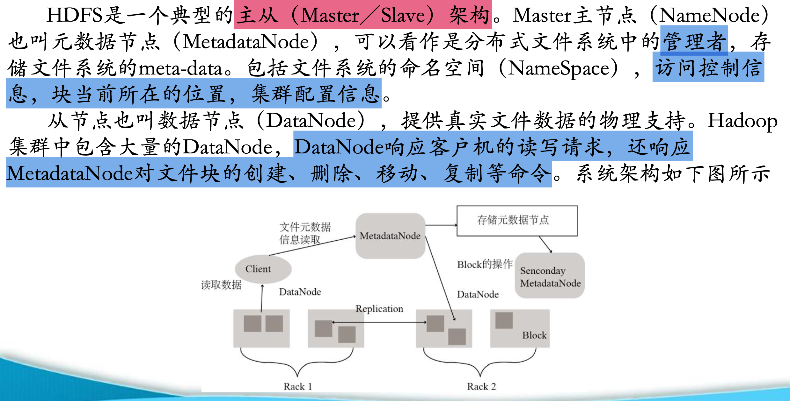
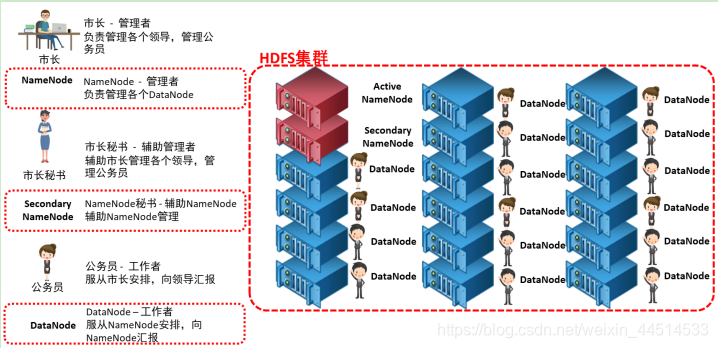
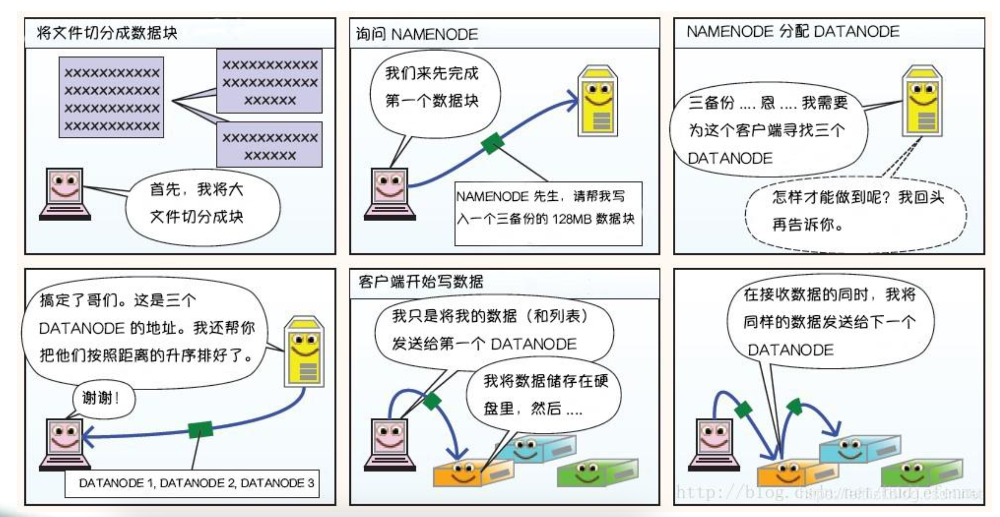
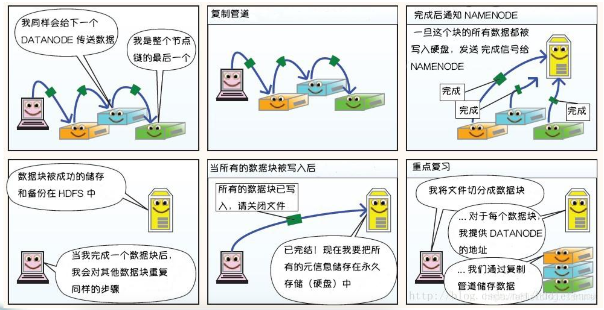

# HDFS (Hadoop Distributed File System)
>https://blog.csdn.net/weixin_44514533/article/details/102890306 HDFS Basic Introduction
- Node \ Block \ Distribution
- What it does -> What it solves -> What you encounter
- The relationship between HDFS and RDDs

## ------↓Addendum:↓------
### What is a file system?
- The layer between the operating object (human) and the hard disk
- Imagine this: if there were no file system, how would data packets downloaded from the Internet be stored? Where would they be stored?
- On the hard disk
- However, network transmission is achieved through processes and cannot be written directly to the disk (each process occupies one memory location).
- So the function of the file system is to solve the problem we cannot see: where on the hard disk the data packets are stored.
- PS: Usually, downloads from the Internet are downloaded directly to the Download folder, but now there is no such folder. Therefore, files are downloaded using a command similar to pulling files from a remote terminal.
- Functions:
- Abstracts the hard drive into visible folders
- Distinguishes between different file types (this can be easily accomplished by adjusting the file extension)
- Permission management
- Etc.

## ------↓node \ block \ distribution↓------

### 1. Node
In HDFS, a node refers to any machine that makes up an HDFS cluster. These nodes can have the following roles:
- **NameNode**: Manages the file system namespace and client access to files. It does not store actual data, but rather stores file system metadata, such as file-to-block mappings, file attributes, and the data nodes where blocks reside.
- a. Maintains and manages the file system namespace (metadata information)

- b. Determines the mapping between specified file blocks and specific DataNodes

- c. Maintains and manages the heartbeat information reported by DataNodes
- **DataNode**: The node that actually stores data. Each DataNode manages the storage on its own machine and communicates with the NameNode to report the status of its stored blocks.
- Datanodes are responsible for the storage and management of each block in a file. Each block can reside on multiple Datanodes. Datanodes periodically report their block information to the Namenode, storing multiple replicas.
- Heartbeat: The return value contains commands sent by the Namenode to the Datanode, such as replicating block data to another machine or deleting a block. If a Datanode fails to receive a heartbeat for more than 10 minutes, the node is considered unavailable.

### 2. Blocks
- HDFS divides files into a series of blocks. By default, each block is 128MB in size.
- This size is configurable.
- 128 is just a number. If the data exceeds 128MB, it is split. If it does not exceed 128MB, it is not split. Any block under 128MB is considered a block. The size of this block is 100MB.
- Each block can be independently replicated on different DataNodes in the cluster to provide fault tolerance. Blocks are the basic unit of data storage and replication in HDFS.

### 3. Data Distribution
- **Data Replication**: To improve data reliability and availability, each block has multiple replicas (the default is three). HDFS attempts to distribute these replicas across different nodes to prevent single points of failure.
- **Data Balancing**: HDFS monitors data distribution within the cluster and automatically rebalances data when necessary to ensure even distribution and avoid overloading certain nodes.
- **Data Placement Policy**: HDFS uses specific strategies to determine where to store blocks. For example, the first replica is typically stored on the node where the client writes the data, and subsequent replicas are stored on different nodes to optimize network bandwidth usage.

## -----↓ What to Do -> What to Solve -> What to Encounter ↓-----
### 1. Purpose of HDFS
- **Large-Scale Data Storage**: HDFS is designed to store large datasets and can handle terabytes or even petabytes of data. It achieves high-capacity storage by distributing data across multiple nodes. - **High Fault Tolerance**: HDFS is highly fault-tolerant. By storing multiple replicas of data across multiple nodes (three replicas by default), data is protected against failures, ensuring data reliability and availability.
- **High Throughput**: HDFS optimizes data read and write operations, providing high-throughput data access and suitable for batch processing and analysis of large-scale data.
- **Support for Multiple Computing Frameworks**: HDFS is a core component of the Hadoop ecosystem and seamlessly integrates with computing frameworks such as MapReduce, Spark, and Hive, providing powerful storage support for big data processing.
- **Scalability**: HDFS offers excellent horizontal scalability, allowing storage capacity and computing power to be expanded by adding nodes, making it suitable for dynamically growing data storage needs.

### HDFS Read and Write Process
- The Master Node (NameNode) manages all file system metadata, providing a tree-structured metadata representation of all files and directories.
- It implements client-side file operation control and storage task management and allocation, determining the mapping of data blocks to DataNodes.
- Clients are applications that require access to the distributed file system.

#### (1) HDFS file writing

① The client initiates a file writing request to the NameNode;
② The NameNode returns the information of the DataNodes it manages to the Client based on the file size and file block configuration;
③ The client divides the file into multiple file blocks and writes them to each DataNode block in sequence based on the DataNode address information.

#### (2) HDFS file reading

① The client initiates a file reading request to the NameNode;
② The NameNode returns the information of the DataNode where the file is stored;
③ The client reads the file information.

### 2. Problems solved by HDFS
- **Large-scale data storage**: Traditional file systems face storage capacity and performance bottlenecks when processing large-scale data. HDFS solves the problem of large-scale data storage by distributing data across multiple nodes through distributed storage.
- **Data Reliability Issues**: Node failures are common in distributed systems. HDFS uses data redundancy (three replicas by default) to ensure complete data recovery even if some nodes fail, improving data reliability.
- **High-Throughput Data Access Issues**: HDFS optimizes data read and write operations, providing high-throughput data access. This makes it suitable for batch processing and analysis of large-scale data, addressing the performance bottlenecks of traditional file systems in high-throughput scenarios.
- **Data Consistency Issues**: HDFS ensures data consistency through strict write and read mechanisms. For example, when writing data, the write is not confirmed successful until all replicas have been successfully written, avoiding data inconsistencies.
- **Scalability Issues**: HDFS supports dynamic expansion, allowing storage capacity and computing power to be expanded by adding nodes, addressing the scalability limitations of traditional file systems.

### 3. Issues Encountered by HDFS
- **Performance Bottlenecks**:
- **Metadata Management**: HDFS metadata (such as the file system tree and file and directory attributes) is stored in the NameNode's memory. As data volume increases, the size of this metadata also increases, potentially causing the NameNode to run out of memory and impacting performance. - **Small File Issue**: HDFS is inefficient when processing large numbers of small files. Each file's metadata consumes NameNode memory, and a large number of small files can increase NameNode memory pressure, impacting system performance.
- **Fault Tolerance Issue**:
- **NameNode Single Point of Failure**: Although HDFS can improve fault tolerance by setting up a standby NameNode, in some cases the NameNode remains a potential single point of failure. If a NameNode fails, the entire file system may become unavailable.
- **Data Replica Consistency**: In distributed systems, data replica consistency is a complex issue. Although HDFS uses heartbeat mechanisms and data checksums to ensure replica consistency, data inconsistencies can still occur in certain failure scenarios.
- **Operational Complexity**:
- **Cluster Management**: Deploying and managing an HDFS cluster requires technical knowledge and experience. A range of operational tasks are required, including cluster configuration, monitoring, backup, and fault recovery.
- **Performance Tuning**: HDFS performance tuning is complex and requires configuration and optimization based on specific business requirements and data characteristics. For example, parameters such as block size, number of replicas, and memory allocation may need to be adjusted. - **Security Issues**:
- **Permission Management**: HDFS permission management is relatively simple, primarily based on file and directory permissions. In complex multi-user environments, more granular permission management may be required.
- **Data Encryption**: Although HDFS supports data encryption, in practice, the performance overhead of data encryption and decryption is significant and may affect system performance.
- **Ecosystem Compatibility**:
- **Integration with Traditional Systems**: HDFS is complex to integrate with traditional relational databases and file systems, requiring additional adaptation and conversion tools.
- **Compatibility with Other Big Data Tools**: Although HDFS is a core component of the Hadoop ecosystem, integration with other big data tools (such as Spark and Flink) may encounter compatibility issues.

### Summary
As a distributed file system, HDFS addresses issues such as large-scale data storage, data reliability, high-throughput data access, data consistency, and scalability, providing powerful storage support for big data processing. However, HDFS also faces challenges in performance, fault tolerance, operational complexity, security, and ecosystem compatibility. These issues need to be addressed through technical improvements and optimizations to better meet the needs of big data processing.

## -----↓The Relationship Between HDFS and RDDs↓-----
- `Data Storage`: HDFS can be used as the storage system for RDD data. Spark can read data from HDFS to create RDDs and write data from RDDs back to HDFS.
- `Data Processing`: RDDs enable complex data processing, while HDFS provides a reliable storage system for this data. The combination of these two enables Spark to efficiently perform large-scale data processing on HDFS.
- `Fault Tolerance`: HDFS provides fault tolerance at the storage layer through data replication, while RDDs provide fault tolerance at the computation layer through lineage information. This dual-layer fault tolerance ensures reliable data processing.
- `Performance Optimization`: Because RDDs support data persistence (caching), Spark can optimize data access patterns, cache data in memory, reduce the number of HDFS reads, and thus improve data processing performance.