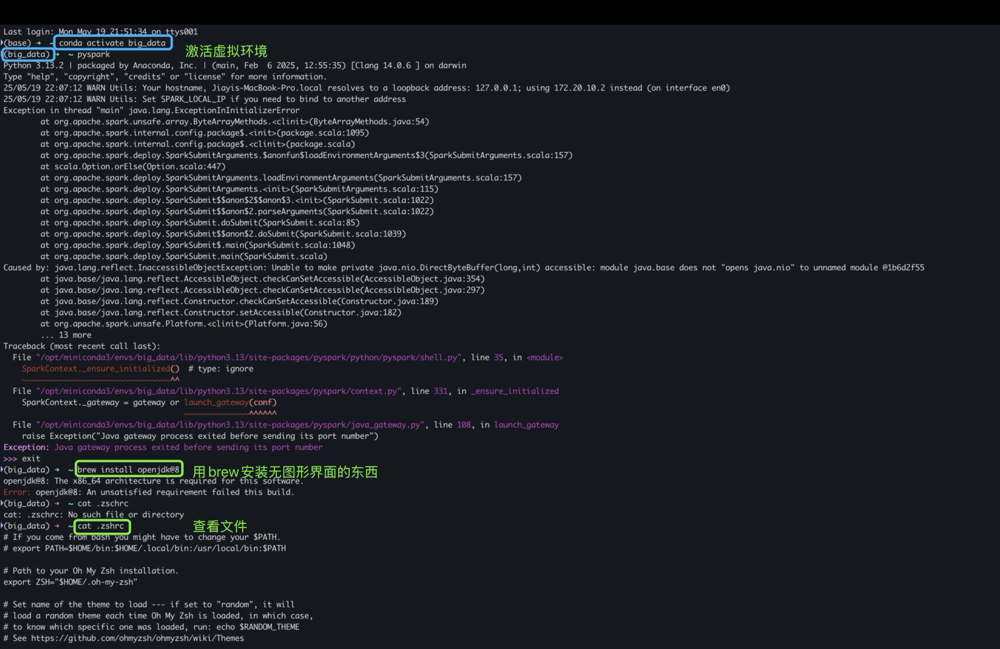

# Table of contents
- 1. Creating a virtual environment with conda

- 2. Using Matplotlib in Vscode on macOS with garbled Chinese fonts

- 3. Terminal Commands (macOS)

- 4. Terminal Commands - Figure Example (including: starting PySpark and downloading with Brew)

ps:

cd /opt --> The "/" refers to the root directory

cd .. --> Return to the previous folder

## 1. Creating a virtual environment with conda

`Creating a virtual environment`
conda create -n your_env_name python=x.x

`Activating the newly created virtual environment`
conda activate your_env_name

`Exiting the current virtual environment`
conda deactivate

`Deleting the current virtual environment`
conda env remove -n your_env_name

`Viewing all virtual environments`
conda info --envs **(Environments marked with * are currently active)**

`Viewing the installed packages in a virtual environment`
conda list **(Activate the virtual environment first)**

## 2. Using Matplotlib in Vscode on macOS with garbled Chinese fonts

Copy and paste in its entirety

import matplotlib.pyplot as plt
import matplotlib
matplotlib.rcParams['font.family'] = 'Arial Unicode MS' # Specify a font that supports Chinese
matplotlib.rcParams['font.size'] = 12
matplotlib.rcParams['axes.unicode_minus'] = False # Correctly display the minus sign

## 3. Terminal Commands on macOS

#### 1. File and Directory Operations

- `ls`: List directory contents.
- `cd`: Change the current directory.
- `pwd`: Print the path of the current working directory.
- `mkdir`: Create a new directory.
- `rmdir`: Remove an empty directory.
- `touch`: Create a new file or update the timestamp of an existing file.
- `cp`: Copy a file or directory.
- `mv`: Move or rename a file or directory.
- `rm`: Delete a file or directory.
- `cat`: View file contents.
- `nano` or `vim`: Text editor for editing files.
- `open`: Open a file for editing.

#### 2. File System Operations

- `df`: Displays file system disk space usage.
- `du`: Estimates the disk space usage of a file or directory.

#### 3. Permission Management

- `chmod`: Changes file or directory permissions.
- `chown`: Changes the owner of a file or directory.
- `chgrp`: Changes the group of a file or directory.

#### 4. Network Operations

- `ping`: Tests network connectivity between hosts.
- `curl` or `wget`: Downloads files from the network.
- `ifconfig` or `ip`: Views or configures network interfaces.

#### 5. System Information

- `uname`: Displays system information.
- `uptime`: Displays system uptime.
- `top` or `htop`: Displays running processes on the system.
- `ps`: Displays the status of the current process.
- `kill`: Terminates the process.

#### 6. Package Management

- `brew`: Homebrew is a package manager on macOS, used to install software packages.
- `brew install package_name`: Installs a software package.
- `brew list`: Lists installed packages.
- `brew update`: Updates Homebrew and synchronizes the local database.

#### 7. Other

- `alias`: Creates a command alias.
- `history`: Displays command history.
- `clear`: Clears the terminal screen.

The macOS terminal supports a large number of commands. You can use the `man` command to view a command's manual page for more information. For example, `man ls` displays the manual page for the `ls` command.

#### 4. Terminal Commands - Illustrations (including: starting PySpark and downloading with Brew)

