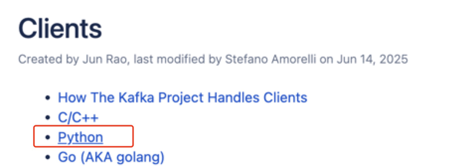
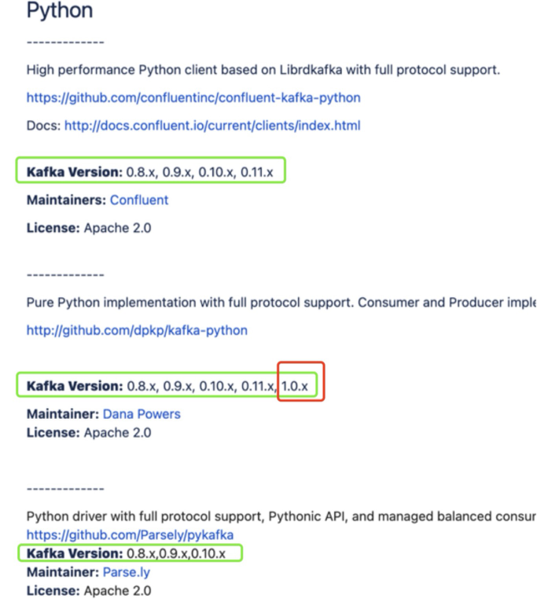

# Table of Contents
### 1. Concepts
#### (1) The main functions of kafka are
`Publish and subscribe to streaming records` / `Store streaming records` / `Peak elimination` [the first two are the most important]
#### (2) Features
#### 1. Kafka solves remote communication problems
#### 2. Kafka is a service that occupies a port
#### 3. Kafka is generally not installed locally
#### 4. Kafka relies on memory and hard disk (disk: persistence)
#### 5. C is the sender, O is the intermediate key, S is the receiver
##### (1) Synchronous and asynchronous sending
##### (2) Intermediate key [relational database / topic]
#### 6. How to store data in kafka --> `Two computers, one Topic, two partitions, two replicas, three producers (C1, C2, and C3), two consumers

### 2. Code
https://kafka.apache.org/

#### (I) QUICKSTART
#### (II) CLIENT

# I. Concepts

[PS: When asked about the concept of a component or other thing, first describe its function and then expand on its features/characteristics.]

## (I) Kafka's main functions are:
(For details, see **[note07]kafka.md**)
- `Publishing and subscribing to streaming records`
- `Storing streaming records`
- Kafka is suitable for processing streaming data. Streaming data is like water flowing from a tap --> it can be broken down into small portions

- `Peak sales` [not the most important]
- Buffering
- Flash sale scenarios
- Ticket grabbing: On a certain day, there were 300 tickets available for Zhuhai Ocean Kingdom
- Once the ticket grabbing period is up 100,000 requests pour into the server: like water pouring from a tap into Kafka.
- This data is stored in topics, which can be the same topic or different topics.
- Topics are sorted in the order they were sent and are not reordered. Consumers pull data in the order they arrive first (traditional databases do this reordering).
- The server pulls data from Kafka, and the number of records it pulls depends on how many records the server can handle at once.
- P.S. If it were a relational database, rather than a topic, it would be very, very slow because each incoming data entry would need to be reordered by primary key.

## (II) Features:

### 1. Kafka solves remote communication problems
- Communication issues fall under the topic of **Computer Networks**

### 2. Kafka is a service, occupying a port.
- Service: A process that provides a service, each process occupies a port.
- Spark itself is also a service.
- A queue is a service.

### 3. Kafka is generally not installed locally.
- The product is a public service, so it's not deployed locally.

### 4. Kafka relies on memory and hard disk (storage: persistence).
- From a data storage perspective: if the process crashes, memory is released and lost.

-----
### 5. C is the sender, O is the intermediate key, and S is the receiver.
C: Dedicated to sending messages.

S: A database, used for storage.

Producer-Consumer: Producer
Publish-Subscribe: Publisher subscriber

kafka is the middle key. Producers put the generated data into kafka, and consumers extract data from kafka

#### (1) Synchronous sending and asynchronous sending (process communication in the operating system, not only kafka has this thing)

**Synchronous sending (communication)**: C needs to know that S has received the message before sending the next message to S
- The teacher sends me a message, and waits until I reply to the message before sending the next message to me
- If C keeps waiting for S's reply, C's port will be occupied (wasted)
- In the synchronous case: the middle key will also have feedback

**Asynchronous sending (communication)**: C does not need to know whether S has received the message, so it keeps sending
- The teacher does not care whether I reply to him or not, and keeps sending me messages
- Asynchronous communication: Peak elimination (flash sale scenario) --> Buffering effect

#### (2) Middle key

1) Middle key is a component, called a queue

2) Relational databases are slow because they are ordered
- Sort by primary key, so ordered

3) Topic

- A topic has no size when it's created. The table only grows larger as it stores more data.

- Sorting by insertion time/order: Fast (response is also fast), but wastes disk space (PS: Kafka has high throughput).

- Each topic corresponds to a table. In a distributed architecture, a table corresponds to multiple nodes/computers (storage resources): [N1] [N2] [N3] [N4] (imagine four boxes).

- Two data storage scenarios within a topic:
- Backup: If [N1] can fully store the next data item, a backup of that data item exists in [N2].

- Suppose a data item is divided into two parts, a and b. If [N1] cannot store them all, then a is stored in [N1], b in [N2], a' in [N3], and b' in [N4]. (a' and b' represent backups of a and b, respectively)

- Clustering: High availability --> Data loss is unlikely, as there are backups (if N1/Computer 1 fails, data is lost [because the hard drive also fails, which would result in data loss and loss])

- High aggregation, low coupling (decoupling): Group similar messages into one topic (high aggregation), isolate different businesses with different topics (low coupling)

- Messages describing the same thing belong to the same business

-----
### 6. How to store data in Kafka

- Topics consist of many, and each topic has many partitions

- Kafka relies on Zookeeper: When a leader fails, Zookeeper is responsible for electing a new leader.
- The new leader is selected from a large group of workers, and the new leader still performs the original work.
- This dependency is gradually being eliminated, as having more components means more dependencies, which can easily lead to problems.

- Gateway: The entry point to Kafka (I don't understand this part)

`Two computers, one Topic, two partitions, two replicas, three producers (C1, C2, and C3), and two consumers.

1. P0 and P1 = the two partitions of the topic (Partition-0 and Partition-1).

2. Each partition has a leader, so there are two leaders in total:

• P0 leader → 192.168.0.10:9092 Computer-1

• P1 leader → 192.168.0.11:9092 Computer-2

3. Producers (C1, C2, and C3) connect to the corresponding leader (the only write access point for that partition) based on their IP:port number.

• C1 and C3 send messages to 192.168.0.10:9092 (P0 leader).

• C2 sends messages to 192.168.0.11:9092 (P1 leader).

- The client uses the IP:port address to directly locate the leader computer and writes the message to it.

- That computer (leader) then distributes the same data to followers in the same partition, completing the backup.

- Kafka determines which partition a message is sent to by hashing or polling the key, and leaders for different partitions are on different machines.

- The hashed keys of the messages from C1 and C3 fall into Partition-0, and the leader for P0 happens to be 192.168.0.10:9092, so they send messages directly to this address.

4. Backup: After writing, the leader immediately copies the data to the follower in the same partition (another computer), and the message is written to disk on both computers simultaneously.

5. Consumers also pull messages only from the leader. If a computer fails, the leader for the corresponding partition immediately moves to another computer, allowing the client to seamlessly switch, and data is not lost.

- Clients (producers/consumers) always communicate only with the "leader IP:port" of the current partition; the leader writes locally and then synchronizes the message to the followers, achieving mutual backup between the two computers.

- Partition size is dynamic (its size is determined by its disk usage).
- To reiterate: Suppose you have a collection of student data and put it into Kafka. -> Partition it by gender (partitioning strategy). -> Kafka automatically places different partitions on different nodes (boys in P1 are placed in [N1], girls in P2 are placed in [N2]). -> Later, when new student data is added, the same happens: boys in P1 are placed in [N1], girls in P2 are placed in [N2]. -> Then, for high availability, both partitions are backed up.

# 2. Code
[How to use the official documentation]
https://kafka.apache.org/

## (I) **QUICKSTART**

If you're not sure where to start, generally start by looking at `QUICKSTART`.

Starting the Kafka Environment

## (Part 2) **CLIENT**

1) Kafka server. We are the consumer, so look for something like `Client` on the website.

2) Select a package: Choose the one with the most supported versions. --> Read the Readme first.

3) **Offline Data vs. Real-Time Data**

Offline data: Reads data from the database and then performs a series of operations until completion.

Real-time data: A perpetually running process.

4) Before pushing data to Kafka (sending data), we are always listening to the topic. --> Only by listening first and then sending data can we pull data.

- Listening here refers to: consumers pulling data.
- It’s not the monitoring I understood before: always paying attention to the status of a service