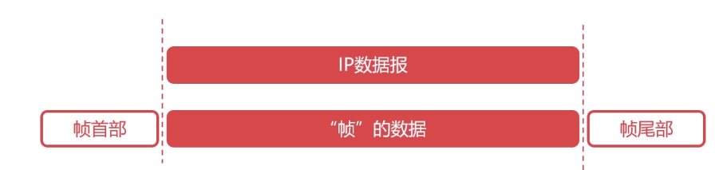
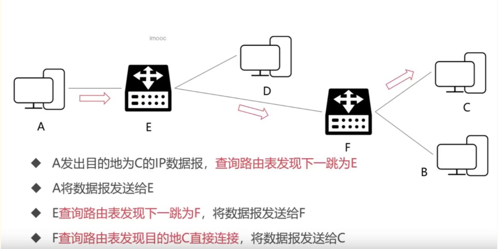
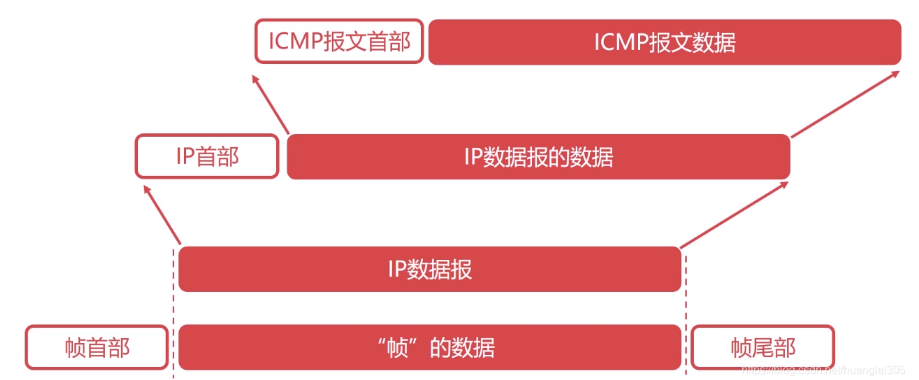

https://blog.csdn.net/Royalic/article/details/119985591
- `服务`->不停运行的程序，有接收请求+响应
- `服务器`->可以运行程序(访问),也可以给别人访问
    
    - IP地址得不变

- `端口`(port):又叫插口。标记不同的网络进程

------
### `进程` 和 `线程`
进程包含线程：线程是进程中的一个执行单元，一个进程至少包含一个线程
- 进程 --> 独占内存,包含程序的所有信息
- 线程 是进程的子单位

进程：是程序的执行实例，是系统进行资源分配和调度的基本单位。它包含了程序运行所需的所有资源，如内存空间、文件句柄、设备等。

线程：是进程中的一个执行单元，是操作系统能够进行运算调度的最小单位。它与同属一个进程的其他线程共享进程所拥有的全部资源，但线程自身也有一些私有数据。

------
### 一.`物理层`
连接不同的物理设备，传输比特流

1字节（Byte）== 8个比特（Bit）

### 二. `数据链路层`：(存MAC地址->物理地址)
1. 数据链路层为网络层提供可靠的数据传输；
2. 基本数据单位为帧；(封装成帧)

3. 主要的协议：以太网协议；
4. 两个重要设备名称：网桥和交换机。
 
       - 【在网络层工作】路由器->IP地址(IP表)
       -  Switch->MAC地址(物理地址)

### 三. `网络层`
1. 网络层负责对子网间的数据包进行路由选择。此外，网络层还可以实现拥塞控制、网际互连等功能；

2. 基本数据单位为IP数据报；

3. 包含的主要协议：

- **IP协议**（Internet Protocol，因特网互联协议）;
    - IP协议的转发流程
    
- ICMP协议（Internet Control Message Protocol，因特网控制报文协议）;
    - 可以报告错误信息或者异常情况,ICMP报文封装在IP数据报当中
    
- ARP协议（Address Resolution Protocol，地址解析协议）;
- RARP协议（Reverse Address Resolution Protocol，逆地址解析协议）。

4. 重要的设备：路由器。

### 四.`传输层`

1. 传输层负责将上层数据分段并提供端到端的、可靠的或不可靠的传输以及端到端的差错控制和流量控制问题；

2. 包含的主要协议：TCP协议（Transmission Control Protocol，传输控制协议）、UDP协议（User Datagram Protocol，用户数据报协议）；

3. 重要设备：网关。

### 五.`应用层`
1. 为操作系统或网络应用程序提供访问网络服务的接口

2. 数据传输基本单位为报文

3.包含的主要协议：FTP（文件传送协议）、Telnet（远程登录协议）、DNS（域名解析协议）、SMTP（邮件传送协议），POP3协议（邮局协议），HTTP协议

一些概念

