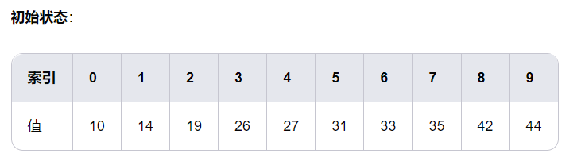
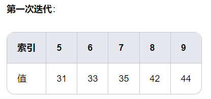
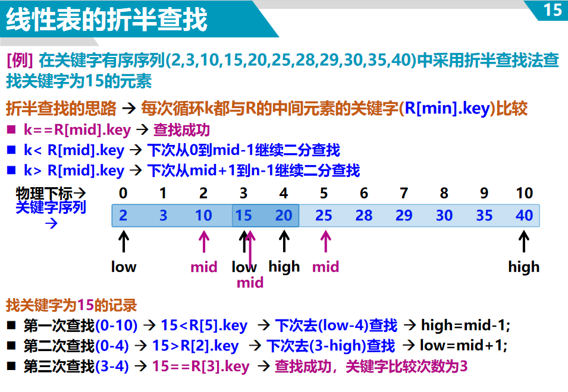
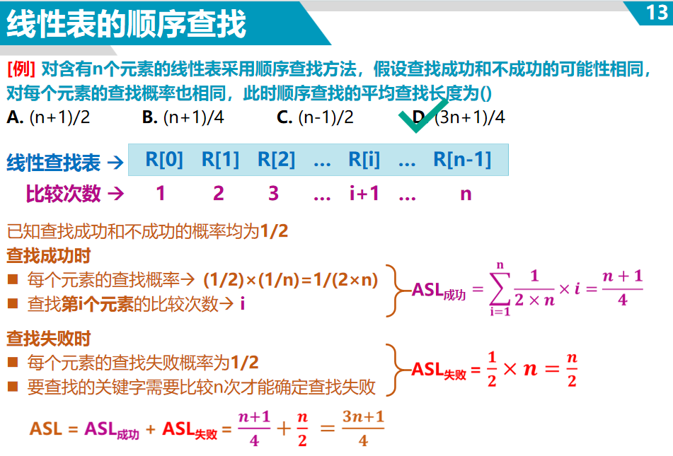
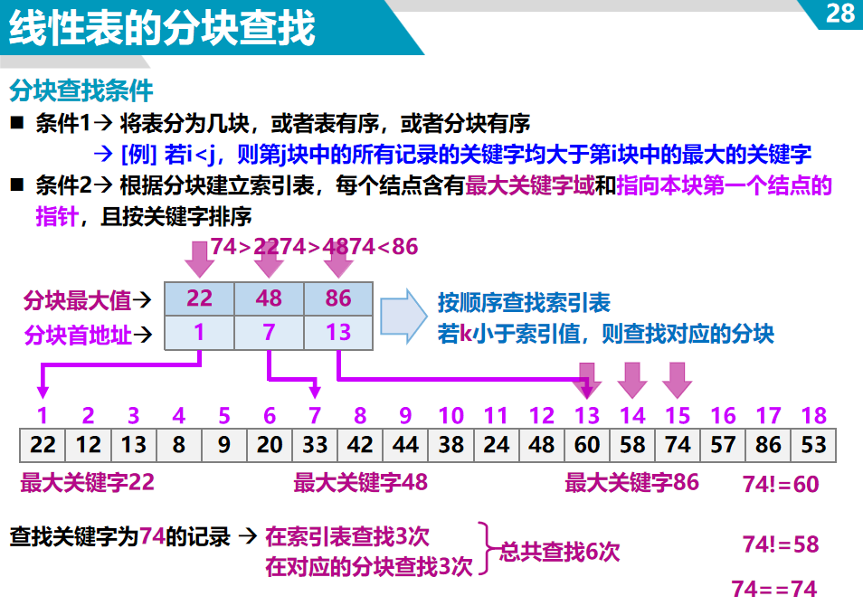
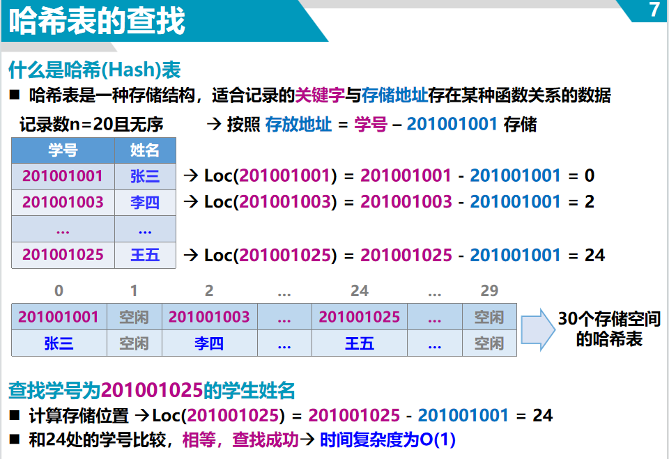
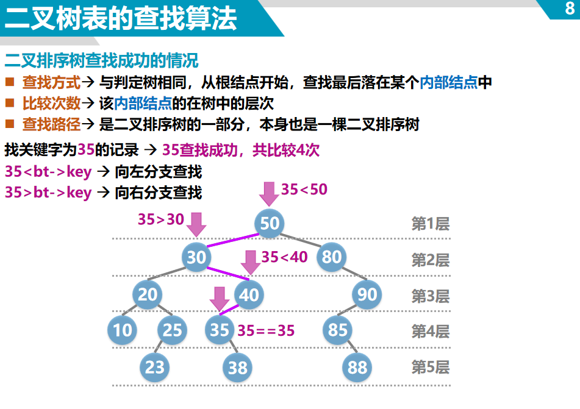
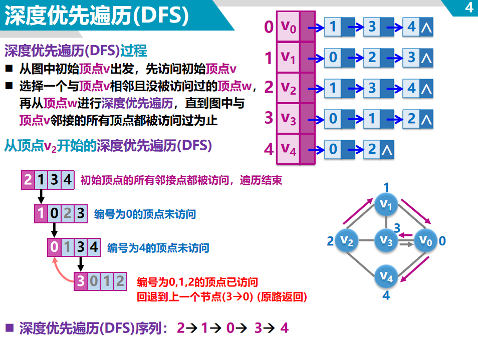
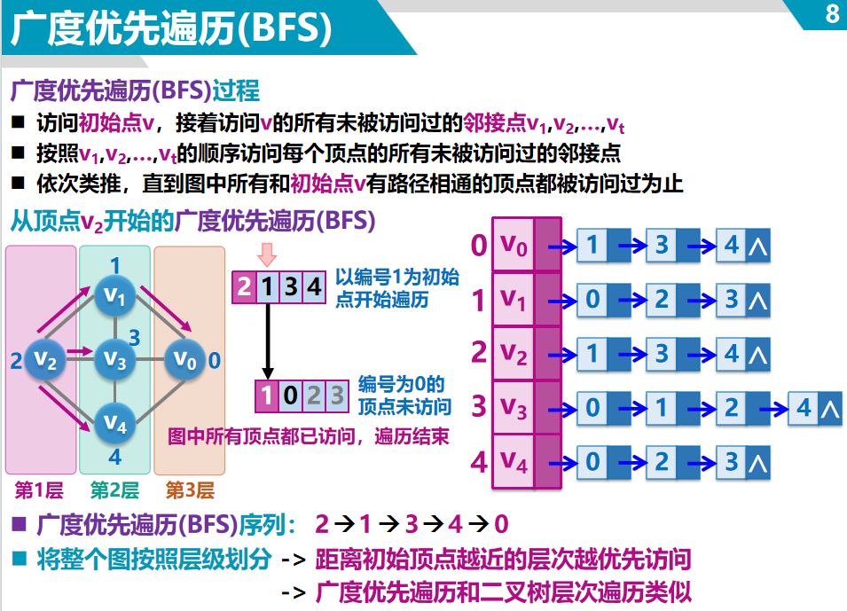

# 1.**Binary Search Algorithm-二分查找算法**
**思想：**适用于有序数组。其核心思想是通过不断将查找范围缩小一半，从而快速定位目标值。

**图解：**

存在一个升序数组 [10, 14, 19, 26, 27, 31, 33, 35, 42, 44]

目标值为 31


- left = 0，right = 9，mid = (0 + 9) // 2 = 4。
- array[mid] = 27 < 31，目标值在右半部分，更新 left = mid + 1 = 5。


- left = 5，right = 9，mid = (5 + 9) // 2 = 7。
- array[mid] = 35 > 31，目标值在左半部分，更新 right = mid - 1 = 6。


- left = 5，right = 6，mid = (5 + 6) // 2 = 5。
- array[mid] = 31 == 31，找到目标值，返回索引 5。



```python
def binary_search(the_list, target_number):
    left=0
    right=len(the_list)-1
    while right >= left:
        # mid = (right-left)/2 + left
        mid = (right + left)//2
        if the_list[mid]== target_number:
            return True
        elif the_list[mid] > target_number:
            right=the_list[mid]-1
        else:
            left=the_list[mid]+1
    return False
```
# 2. **Linear Search-线性查找**
**思想：**适用于无序数组或链表。

**算法步骤：**
1. 从数组的第一个元素开始，逐个检查每个元素是否等于目标值。
2. 如果找到目标值，返回其索引。

   如果遍历完整个数组仍未找到目标值，返回 -1。

**时间复杂度：**
- 最坏情况：O(n)，其中 n 是数组的长度。
- 最好情况：O(1)，如果目标值是第一个元素。
- 平均情况：O(n)。




# 3. **Hash Table Search-哈希表查找**

**思想：**适用于需要快速查找、插入和删除的场景。它通过哈希函数将键映射到表中的位置，从而实现快速访问。

**时间复杂度：**
- 平均情况：O(1)。
- 最坏情况：O(n)，当哈希冲突过多时。



# 4. **BST-二叉查找树**



# 5. **图的遍历**



