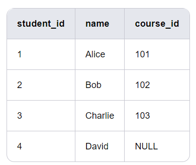
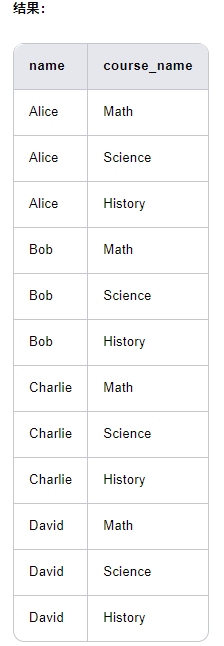

# **SQL_JOIN**

假设有两个表：students 和 courses，它们通过 course_id 关联。

表1：students



表2：courses


1. INNER JOIN（内连接）:返回两个表中匹配的行。如果不匹配，则不会返回任何行。
```sql
SELECT students.name, courses.course_name
FROM students
INNER JOIN courses
ON students.course_id = courses.course_id;
```


2. LEFT JOIN（左连接）:返回左表（table1）的所有行，即使右表（table2）中没有匹配的行，也会返回左表的行，右表的列则为 NULL。
```sql
SELECT students.name, courses.course_name
FROM students
LEFT JOIN courses
ON students.course_id = courses.course_id;
```

3. RIGHT JOIN（右连接）:返回右表（table2）的所有行，即使左表（table1）中没有匹配的行，也会返回右表的行，左表的列则为 NULL。
```sql
SELECT students.name, courses.course_name
FROM students
RIGHT JOIN courses
ON students.course_id = courses.course_id;
```


4. FULL OUTER JOIN（全外连接）:返回左表和右表的所有行，无论是否匹配。不匹配的行会在另一表的列中填充 NULL。
```sql
SELECT students.name, courses.course_name
FROM students
FULL OUTER JOIN courses
ON students.course_id = courses.course_id;
```


- 返回两个表中的所有行，无论是否匹配。
- 不匹配的行在另一表的列中填充 NULL。

5. CROSS JOIN（交叉连接）:返回两个表的笛卡尔积，即左表的每一行与右表的每一行组合。
```sql
SELECT students.name, courses.course_name
FROM students
CROSS JOIN courses;
```


- 返回两个表的笛卡尔积，即左表的每一行与右表的每一行组合。
- 总行数为 students 表的行数乘以 courses 表的行数。

6. SELF JOIN（自连接）:一个表与自身进行连接。通常用于处理表内的层级关系或关联关系。

    假设 students 表中有一个 manager_id 列，表示每个学生的导师（导师也是学生）。
    
```sql
SELECT s1.name AS student_name, s2.name AS manager_name
FROM students AS s1
LEFT JOIN students AS s2
ON s1.manager_id = s2.student_id;
```

- s1 表示学生，s2 表示导师。
- 通过 manager_id 将学生与导师关联。
- 如果学生没有导师（如 Alice），manager_name 为 NULL。