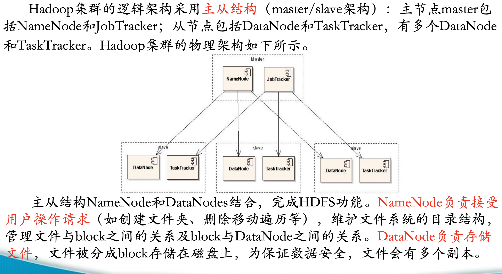
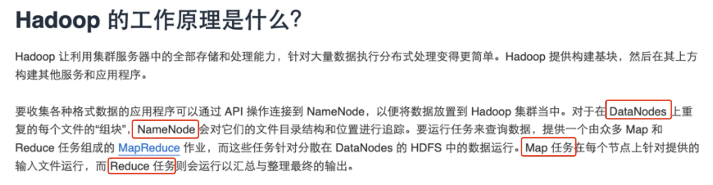

# HADOOP,YARN,ZOOKEEPER,HIVE,FLINK

## -----↓补充↓-----
`Hadoop`的本质是程序：hdfs和mapreduce这两个部份

`Hive`的本质是翻译官 
对应引擎的语言

>程序运行 
>>把电脑抽象成节点：namenode和worknode

>>   实际存储落到worknode的硬盘上
把硬盘抽象成文件资源管理器

`Flink`**流数据**（和kafka合作）/ `spark`**批数据** / `mapreduce`基本不用 -> 这三者功能类似

**流数据** 大部份存储在内存里

**批数据** 存储在hadoop的hdfs里

## Hadoop

`Hadoop` 是一种开源框架，用于高效存储和处理从 GB 级到 PB 级的大型数据集。利用 Hadoop，可以将多台计算机组成集群以便更快地并行分析海量数据集，而不是使用一台大型计算机来存储和处理数据。

**它有两个主要部分：**

`HDFS`（Hadoop Distributed File System）：这是 **Hadoop 的文件系统**，就像仓库里的货架，把数据分成一块一块的（数据块），然后分散存放在不同的服务器上。这样即使某个服务器坏了，数据也不会丢失，因为还有备份。

`MapReduce`：这是 **Hadoop 的计算框架**，就像仓库里的搬运工。它能帮你把数据拿出来，按照你的要求进行加工处理，比如统计一下有多少张图片，或者找出某个单词出现的次数。

## YARN
`YARN` 是一个资源管理器，可以理解为仓库里的“管理员”。它负责管理整个仓库的资源，比如服务器的CPU、内存等。当有人（比如 MapReduce/spark）需要资源来处理数据时，YARN 就会分配合适的服务器和资源，确保大家都能够顺利工作，不会互相抢资源。
## Zookeeper
`Zookeeper` 好像是一个“协调员”，它主要负责**协调各个组件之间的通信和协作**。比如，当有很多个服务器在运行 Hadoop 时，Zookeeper 就能帮助它们知道彼此的状态，比如哪个服务器正在工作，哪个服务器已经挂掉了。它还能保证数据的一致性，就像一个监督员，确保数据在各个服务器之间同步得很好，不会出现乱七八糟的情况。
## Hive
`Hive` 是一个**数据仓库工具**，它就像是仓库里的一个“图书馆管理员”。它可以帮助你把数据按照一定的规则整理好，方便你快速查找和分析数据。比如，你可以用 Hive 把数据按照日期、类型等分类存储，然后用 SQL（一种数据库查询语言）来查询数据，比如“找出2025年4月17日上传的所有图片”。它让数据的管理和查询变得非常方便。
## Flink
`Flink` 是一个强大的**流处理引擎**，就像一个“快递员”。它专门用来处理实时的数据流，比如从传感器传来的数据、用户在网站上的点击行为等。Flink 可以快速地处理这些数据，实时地给出结果。比如，它可以实时统计某个网站上每分钟的点击量，或者实时监测某个设备的温度是否异常。
## 它们之间的关系

`Hadoop` 是**基础**，提供了存储（HDFS）和计算（MapReduce）的功能。其他组件很多都是在 Hadoop 的基础上运行的。

`YARN` 是**资源管理器**，它负责分配资源给 Hadoop 的 MapReduce、Flink 等计算框架，让它们能够顺利运行。

`Zookeeper` 是**协调员**，它帮助 Hadoop、Hive、Flink 等组件之间进行通信和协调，确保整个系统能够正常运行。

`Hive` 是**建立在 Hadoop 之上的数据仓库工具**，它利用 Hadoop 的存储和计算能力，方便用户管理和查询数据。

`Flink` 是一个独立的**流处理引擎**，但它也可以和 Hadoop 的存储系统（HDFS）结合，从 Hadoop 中读取数据，或者把处理结果存到 Hadoop 中。同时，Flink 也依赖 YARN 来管理资源，依赖 Zookeeper 来协调。

