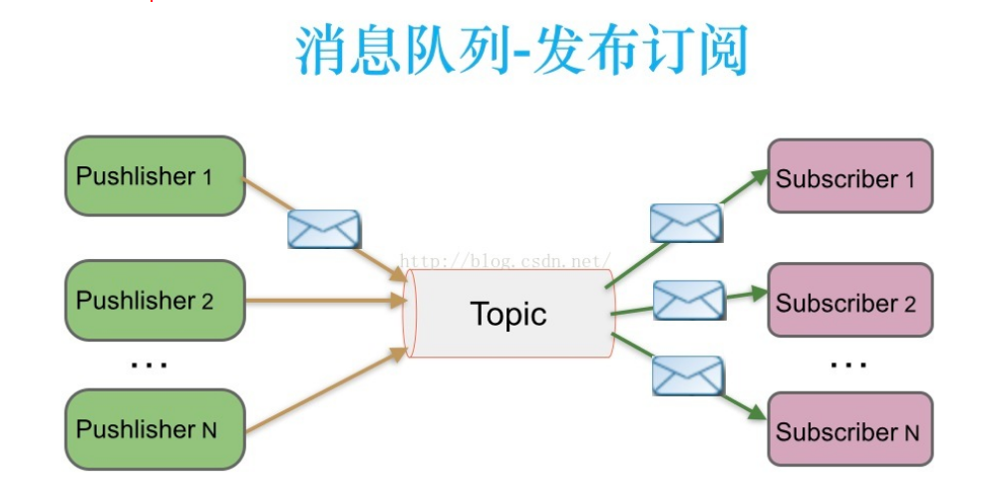
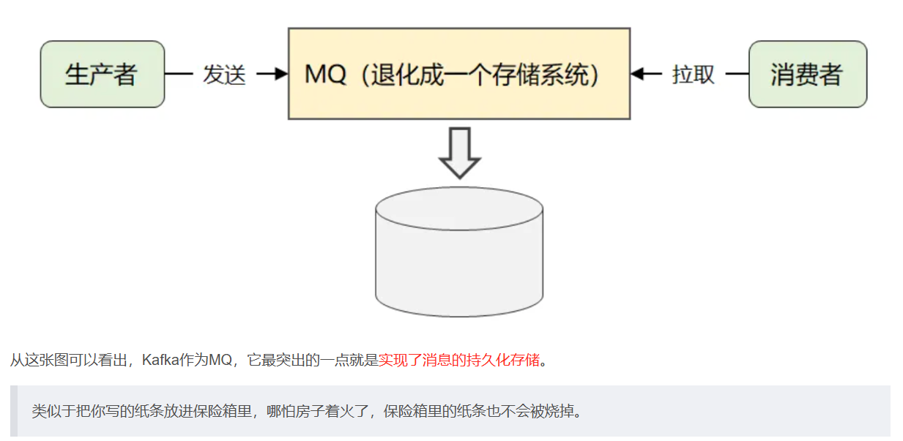

# kafka
>https://kafka1x.apachecn.org/intro.html
## -----↓优化版笔记↓-----
## 1.Kafka用来干嘛：
- `发布和订阅流式记录`：Kafka允许用户发布和订阅连续的数据流，类似于消息队列或企业消息系统。
   - 在发布-订阅消息系统中，**消息被持久化到一个topic中**。消费者可以**订阅一个或多个topic**，消费者可以消费该topic中所有的数据，同一条数据可以被多个消费者消费，数据被消费后不会立马删除。在发布-订阅消息系统中，消息的生产者称为发布者，消费者称为订阅者。该模式的示例图如下：
       - 特点：发布/订阅：Topic，可以重复消费
- `存储流式记录`：Kafka可以存储流式数据，并且具有良好的容错性。
   - `流数据`：在源源不断、实时生成的数据序列。这种数据不是一次性加载到内存中，而是连续地到达，需要被即时处理和分析
      - **流数据大部份存储在内存里**
- `实时数据处理`：Kafka能够在数据产生时就进行处理，适用于实时流数据处理。

## 2.Kafka解决了什么问题：
- `数据管道的可靠性`：Kafka通过其分布式架构和持久化机制，确保了数据传输的可靠性。
   - `持久化`：就是放在硬盘
- `数据的有序性和一致性`：Kafka保证在每个分区内，记录是有序的，并且消费者可以按照日志中的顺序查看记录。
- `可扩展性`：Kafka通过分区机制，允许日志扩展，处理无限量的数据。
- `容错性`：Kafka通过在多个服务器上备份分区，确保了系统的容错性。
- `实时处理能力`：Kafka能够在数据产生时就进行处理，支持实时流数据处理。

## 3.Kafka遇到的挑战：
- `运维复杂性`：随着集群规模的扩大，运维Kafka集群可能会变得更加复杂。
- `资源管理`：需要合理分配和管理系统资源，以确保Kafka的性能和稳定性。
- `安全性问题`：需要确保数据传输和存储的安全性，防止数据泄露或未经授权的访问。
- `监控和故障恢复`：需要有效的监控机制和故障恢复策略，以应对可能出现的系统故障。
- `版本兼容性`：随着Kafka版本的更新，可能需要处理新旧版本之间的兼容性问题。

## -----↓初始版笔记↓-----
## 1.Kafka 是什么？

`Kafka` 是一个开源的**分布式流处理平台**，最初由 LinkedIn 开发并开源，现在由 Apache 软件基金会维护。它主要用于构建高吞吐量、低延迟、可扩展的实时数据管道和流式应用程序。

#### ------↓易理解版↓------
##  2. Kafka的消息模型​​​​​

**总结**：Kafka通过`消息的持久化存储`，确保消息不会丢失，保证系统可靠性。

    持久化：就是指放在硬盘。但不是所有的都可以持久化，可以配置。

**大白话**：Kafka就像一个超级稳的邮箱，消息存进去后就算系统崩了，也能找到这些消息。

>为什么要实现消息的持久化存储呢？
>>为了保证消息的可靠性和系统的容错性（就是为了确保消息不会丢掉，即使系统出现问题，也能恢复正常）

## 3. Kafka存储问题的解决方案

**总结**：Kafka通过`分布式存储、消息副本、日志文件和过期策略`，解决了存储的可扩展性和数据安全问题。

**大白话**：Kafka就像把消息放到多个保险箱里，每个保险箱里有多个副本，坏了一个也不怕，甚至可以定期清理老旧消息。

## 4. Kafka整体架构

**总结**：Kafka的架构包含了多个Broker、Partition等组件，`Partition`负责消息的分发和存储，是系统的核心。

**大白话**：Kafka的架构就像一个有多个仓库的库房，每个仓库存不同的消息，这些仓库通过分片的方式提高了存储和取出的效率。

#### ------↓详细版↓------

## 5.Kafka 的功能

**消息队列**：Kafka 可以作为一个高性能的消息队列系统，支持发布/订阅模式。生产者（Producer）将消息发送到 Kafka 集群，消费者（Consumer）从集群中订阅并消费消息。

**数据存储**：Kafka 将消息持久化到磁盘，支持消息的长期存储。它通过多副本机制确保数据的高可用性和容错性。

**实时流处理**：Kafka 支持对实时数据流的处理，能够快速处理和分析数据。它提供了流处理 API，可以用于复杂的流式数据处理。

## 6.Kafka 的架构
**Broker**：Kafka 集群由多个 Broker 组成，每个 Broker 是一个独立的服务器节点。Broker 负责存储消息、处理生产者和消费者的请求。

**Topic**：消息的分类，类似于数据库中的表。一个 Topic 可以分成多个 Partition（分区），分布在不同的 Broker 上，提高并行处理能力。

**Partition**：Partition 是 Topic 的物理存储单元，是一个有序、不可变的消息队列。每个 Partition 有多个副本（Replication），包括一个 Leader 和多个 Follower。Leader 负责读写请求，Follower 同步数据。

**Producer**：生产者，负责创建消息，然后投递到 Kafka 集群中，投递时需要指定消息所属的 Topic，同时确定好发往哪个 Partition。

**Consumer**：消费者，会根据它所订阅的 Topic 以及所属的消费组，决定从哪些 Partition 中拉取消息。

**Zookeeper**：Kafka 依赖 Zookeeper 来管理集群的元数据，例如集群中有哪些 Broker 节点、每个 Topic 的 Partition 信息等。

## 7.Kafka 与其他组件的关系

**与 Hadoop**：Kafka 可以与 Hadoop 集成，将实时数据流导入到 Hadoop 的存储系统（如 HDFS）中。Kafka 提供了高吞吐量的消息队列功能，而 Hadoop 提供了强大的数据存储和计算能力。

**与 Flink**：Kafka 是 Flink 的常用数据源和数据汇。Flink 可以从 Kafka 中读取实时数据流进行处理，并将结果写回 Kafka。它们共同支持实时流处理和分析。