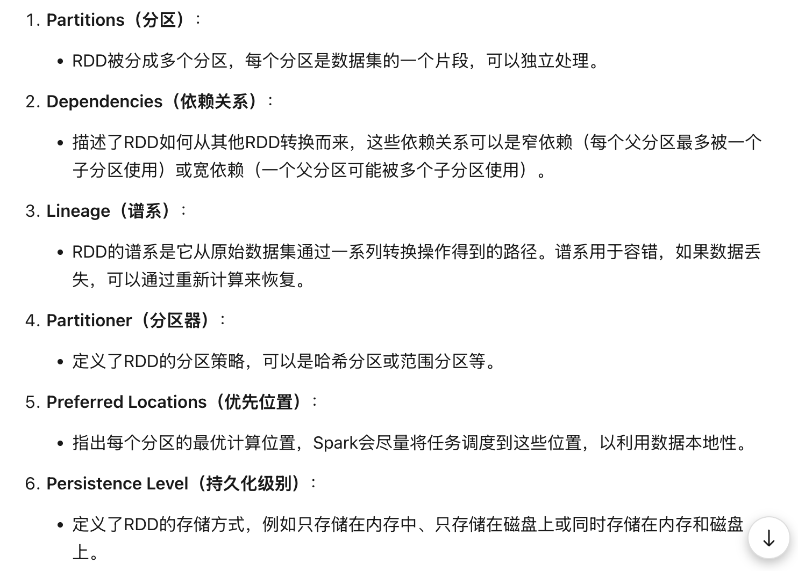
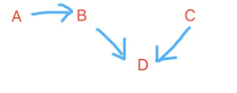

# how to understand RDD
>https://www.zhihu.com/tardis/zm/art/91749572?source_id=1005 Spark 理论基石 —— RDD

>https://www.cnblogs.com/qingyunzong/p/8899715.html Spark学习之路（三）Spark之RDD


1. RDD 的属性
2. RDD是为了解决什么问题
3. RDD 的优点


## 优化版笔记
### 1. RDD的概念
RDD（Resilient Distributed Dataset）叫做**弹性分布式数据集，是Spark中最基本的数据抽象**，它代表一个不可变、可分区、里面的元素可并行计算的集合。RDD具有数据流模型的特点：自动容错、位置感知性调度和可伸缩性。RDD允许用户在执行多个查询时显式地将工作集缓存在内存中，后续的查询能够重用工作集，这极大地提升了查询速度。

    - 基于此抽象，使用者可以在集群中执行一系列计算，而不用将中间结果落盘。->减少开销
          - 可以要求他落盘（可以落盘也可以不落盘） 
          - 落盘就是指放在硬盘
          - 开销：除了指时间 还包括金钱
          - 硬盘比内存便宜（内存贵！！！）

    - 算子理解成为一个function（操作）

    - RDD依赖HDFS
          - RDD也可以不依赖HDFS 
          - 准确来说：Spark和HDFS轻松集成 --> Spark 只用改写配置文件然后导包，不用改写源代码。
               - Spark包含RDD --> RDD可以聚合分片，HDFS的工作要点就是将数据分块
    - mapreduce有两层意思：
          - 概念   ｜ Spark 中的 map函数/reduce函数与 MapReduce 中的 Map/Reduce 阶段类似。
          - （作为）引擎   ｜Spark的产生就是为了代替mapreduce


### 2. RDD 的属性

     针对上图，有以下几个要点：

     1. （1）分片 ：
     1.1 补充
         - 图中标蓝色 重要
         - 数据可以在硬盘里分
         - RDD的分片基于 时间 来分
         - RDD的partition本身在内存，RDD是一种数据类型（类似int，string）
         - CPU 和 Partition 的数量可以不一样

     1.2 HDFS
         HDFS主要和硬盘交互
         - 物理分片 --> 有配置：需指定数据大小

    2. （4）分片函数
         补充：还有一个 Round Robin 轮询
     


- `分片（Partition）`：这是数据集的基本组成单位。在Spark中，每个分片都会被一个计算任务处理。如果没有指定分片数量，**Spark会根据程序可用的CPU核心数来决定。**
- `计算函数（compute）`：在Spark中，每个RDD（弹性分布式数据集）都会实现一个compute函数，这个函数会对每个分片进行计算。计算过程中，不需要保存每次的结果。
- `RDD之间的依赖关系`：RDD的转换操作会生成新的RDD，这些RDD之间存在依赖关系。如果某个分片的数据丢失了，Spark可以通过依赖关系重新计算丢失的数据，而不需要重新计算所有分片。
- `分区函数（Partitioner）`：这是RDD的分片函数。Spark有两种类型的分区函数：一种是**哈希分区（HashPartitioner）**，另一种是**范围分区（RangePartitioner）**。 **只有对于key-value的RDD，才会有分区函数**。分区函数决定了RDD本身的分片数量，也决定了父RDD Shuffle输出时的分片数量。
- `优先位置（preferred location）`：这是一个列表，存储了每个分片的优先存储位置。**对于HDFS文件来说，这个列表保存了每个分片所在块的位置。**Spark在调度任务时，会尽量将计算任务分配到其所要处理数据块的存储位置。

### 3. RDD是为了解决什么问题

- `中间结果落盘问题`：在MapReduce模型中，每个步骤都需要将中间结果写入磁盘，这导致不必要的开销很高。**RDD通过在内存中缓存中间结果，减少了磁盘I/O操作，从而降低了计算延迟。**
   
   -落不落盘是可以选的，也可以只存一部分

- `数据缺少复用`:RDD通过数据集的抽象，允许用户在集群中执行一系列计算，而不需要每次都从磁盘加载数据，从而提高了数据的复用性。
- `容错支持问题`：分布式系统中，节点故障是常见的问题。**RDD通过记录数据的变换路径（谱系），可以在出错后从原始数据集依据谱系图进行重建，从而提供了容错支持。**
    
    - **节点故障**是`现象 --> 1.会带来什么问题； 2.怎么解决。`
         
         - 1. --> 导致数据丢失  （这个是基于 数据处理角度 思考，除了这个问题还会有其他角度的问题，对应其他解决办法）

         - 2. --> 有备份（两种情况：内存备份 / 硬盘备份）
              
              - `内存里的备份（中间结果）`: RDD每个计算步骤的结果不落盘（不存在硬盘里），上一个Output作为下一个Intput，所以结果存在内存里，如果出现节点故障，直接用备份的结果继续计算 --> 不用重新计算。

              - `硬盘里的备份（每个节点可能会存储着其他节点的原始数据，至于存储哪儿个节点，可设置）`：假设共有A/B/C三个节点，因为数据分片，三个节点对应处理不同块数据（data存在各个分节点）。A可能存着B/C的数据，B可能存着A的数据 --> 需要重新计算。

- `计算优化问题`：RDD定义了数据集的基本属性（如不可变、分区、依赖关系、存放位置等），在此基础上可以施加各种高阶算子，构建DAG（有向无环图）执行引擎，并进行适当的优化。
- `交互式查询问题`：RDD通过修改Scala解释器，支持交互式的查询基于多机内存的大型数据集，进而支持类SQL等高阶查询语言。
- `数据局部性问题`：RDD的不可变特性允许系统更容易地对某些计算进行迁移，从而利用数据局部性加快运算速度。
- `内存管理问题`：**当集群内存不足时，RDD可以分批加载数据到内存进行运算**，或者将结果spill到外存，从而在内存不足时提供优雅的退化操作。

    
### 4. RDD 的优点
- `内存存储`：把中间结果放在内存中，计算更快。
- `容错性好`：数据丢了能通过重算恢复，不需要额外备份。
    - RDD只提供粗粒度的、基于整个数据集的计算接口，即数据集中的所有条目都施加同一种操作。这样一来，为了容错，我们只需要备份每个操作而非数据本身；在某个分区数据出现问题进行错误恢复时，只需要从原始数据集出发，按顺序再算一遍即可。
        - `粗粒度`：通常指的是较大、较不详细的处理或操作单位。在RDD的上下文中，粗粒度变换指的是**对整个数据集进行操作**，而不是对数据集中的单个元素进行操作。
        - `接口和属性`：
            - 借口：Transformations（转换操作）、Actions（行动操作）和Persistence（持久化）
            - 属性：
            
              对于上图的 3.Lineage（谱系）：每一张表反应的是一个分区（一段data） --> 看一张表可以追溯带它的源头。

              

              从上图看出 D 的源头： A 和 C
                        
            

- `延迟低`：支持快速的交互式查询。
- `易用性`：支持多种编程语言，使用方便。
- `优化调度`：能自动优化计算流程，提高效率。
   - `显示抽象`：将运算中的数据集进行显式抽象，定义了其接口和属性，从而可以将不同的计算过程组合起来进行统一的DAG（有向无环图）调度。
   - `宽窄依赖`：在进行DAG调度时，定义了宽窄依赖的概念，并以此进行阶段划分，优化调度计算。
        - 粗略理解：宽依赖没有办法实现并行运算 --> 慢
        - 详细版：（**我有一堆纸条 分给朋友们处理**）
            - 窄依赖
                - **每个朋友处理的纸条只来自你给他的那一部分，不需要和其他朋友交换纸条。** --> 朋友A处理第1-10张纸条，朋友B处理第11-20张纸条
                - 数据处理：窄依赖情况下，每个父RDD的分区只会被一个子RDD的分区使用，因此可以直接将父RDD的分区数据传递给子RDD进行处理，避免了数据的shuffle操作，提高了处理效率。
                - 容错机制：当计算出现错误时，只需要重新计算丢失的父分区即可。
            - 宽依赖
                - **每个朋友处理的信息可能来自所有纸条，需要和其他朋友交换纸条。**--> 朋友A处理所有纸条中的“名字”部分，朋友B处理所有纸条中的“年龄”部分
                - 数据处理：宽依赖情况下，需要跨节点进行数据shuffle，以将需要的数据传输到相应的节点进行处理。
                - 容错机制：由于一个父RDD的分区可能被多个子RDD的分区共享，因此需要重新计算出错的父RDD分区及其所有相关的子RDD分区。
- `数据复用`：可以重复使用数据，减少计算量。
   - 就是说：RDD处理后的数据存储在内存中。RDD支持数据容错、数据并行；在此之上，能够让用户利用多机内存、控制数据分区、构建一系列运算过程。从而解决很多应用中连续计算过程对于数据复用的需求。
- `支持并行`：能同时在多台机器上处理数据。
- `节省资源`：内存不够时，能自动把数据移到磁盘，不浪费资源。


## 原始版笔记
## 一、transfrom  \ action \  DAG  \Partition


### 1. transfrom（RDD转换操作

对卡片进行加工(我要把每张卡片上的数字都乘以2)，但不会马上得到最终结果(不会马上看到新的卡片)。

- **定义**：对RDD进行加工处理的操作，如map、filter等，用于生成新的RDD。

- **特点**：是`懒惰操作`，**不会立即执行，只有在触发行动操作时才会真正计算**。

- **常见操作**

    - `Map`：对RDD中每个元素应用函数，生成新的RDD。

    - `Filter`：筛选出满足条件的元素，生成新的RDD。

    - `FlatMap`：将RDD中每个元素映射为多个元素，生成新的RDD。

    - `Union`：合并两个RDD，生成新的RDD。

    - `Join`：对两个RDD进行连接操作，生成新的RDD。


### 2. action（RDD行动操作:

真正开始干活，把转换操作的结果拿出来。

- **定义**：触发RDD计算的操作，用于获取最终结果或输出到外部存储。

- **特点**：会触发RDD的转换操作链的执行，将结果返回给驱动程序或写入外部存储。

- **常见操作**

    - `Collect`：将RDD的所有元素收集到驱动程序中。

    - `Count`：返回RDD中元素的总数。

    - `Take`：返回RDD中的前n个元素。

    - `SaveAsTextFile`：将RDD的内容保存到外部文件中。

    - `Reduce`：对RDD中的元素进行聚合操作，返回一个结果。

### 3. DAG（有向无环图

- **定义**：描述了RDD操作的依赖关系和执行顺序的图。

- **作用**：Spark根据DAG来优化和执行任务，确保操作按正确的顺序执行，提高计算效率。


### 4. Partition（分区

- **定义**：将RDD的数据分成多个子集，每个子集称为一个分区。

- **作用**：分区使得数据可以并行处理，提高计算效率。Spark可以同时对多个分区进行操作，充分利用集群资源。

- **重要性**：合理的分区策略可以减少数据的通信和计算开销，提升性能。

## 二、用Python中的PySpark来说明：RDD的transfrom和action中函数的常见参数

### （一） Transformation：

#### 1. `map` 操作

- **定义**：对RDD中的每个元素应用一个函数，生成一个新的RDD。

- **参数**：一个函数，该函数接收RDD中的每个元素作为输入，并返回一个新的值。

- **示例**：
```Python
from pyspark import SparkContext

sc = SparkContext("local", "RDD Example")
rdd = sc.parallelize([1, 2, 3, 4])
mapped_rdd = rdd.map(lambda x: x * 2)
```
- **参数解释**：lambda x: x * 2 是一个匿名函数，它接收一个参数 x（RDD中的每个元素），并返回 x 的两倍。

#### 2. `filter` 操作

- **定义**：筛选出满足条件的元素，生成一个新的RDD。

- **参数**：一个函数，该函数接收RDD中的每个元素作为输入，并返回一个布尔值（True 或 False）。

- **示例**：
```Python
rdd = sc.parallelize([1, 2, 3, 4, 5])
filtered_rdd = rdd.filter(lambda x: x > 3)
```

- **参数解释**：lambda x: x > 3 是一个匿名函数，它接收一个参数 x（RDD中的每个元素），并返回一个布尔值，表示 x 是否大于3。

#### 3. `flatMap` 操作

- **定义**：将RDD中的每个元素映射为多个元素，生成一个新的RDD。

- **参数**：一个函数，该函数接收RDD中的每个元素作为输入，并返回一个可迭代的集合（如列表、数组等）。

- **示例**：
```Python
rdd = sc.parallelize(["hello world", "spark"])
flat_mapped_rdd = rdd.flatMap(lambda line: line.split(" "))
```

- **参数解释**：lambda line: line.split(" ") 是一个匿名函数，它接收一个参数 line（RDD中的每个字符串），并返回一个列表，包含通过空格分割后的单词。

#### 4. `union` 操作

- **定义**：合并两个RDD，生成一个新的RDD。

- **参数**：另一个RDD，与当前RDD进行合并。

- **示例**：
```Python
rdd1 = sc.parallelize([1, 2, 3])
rdd2 = sc.parallelize([3, 4, 5])
union_rdd = rdd1.union(rdd2)
```

- **参数解释**：rdd2 是另一个RDD，与 rdd1 合并。

5. `join` 操作

- **定义**：对两个RDD进行连接操作，生成一个新的RDD。

- **参数**：另一个RDD，与当前RDD进行连接。

- **示例**：
```Python
rdd1 = sc.parallelize([(1, "a"), (2, "b")])
rdd2 = sc.parallelize([(1, "x"), (2, "y")])
joined_rdd = rdd1.join(rdd2)
```

- **参数解释**：rdd2 是另一个RDD，与 rdd1 进行连接操作。

>**union和join的区别**

>>**union**:

    - 只是将两个RDD中的所有元素合并到一个RDD中，不会进行任何去重或匹配操作。

    - 如果两个RDD中有重复的元素，这些重复的元素也会被保留。

>>**join**:

    - 要求两个RDD都是键值对RDD。

    - 根据键进行匹配，只有键相同的元素才会被组合在一起。

    -结果是一个新的RDD，其中每个元素是一个元组，形如 (key, (value1, value2))
### ( 二 ) Action:

#### 1. `collect` 操作

- **定义**：将RDD中的所有元素收集到驱动程序中。

- **参数**：无参数。

- **示例**：
```Python
rdd = sc.parallelize([1, 2, 3, 4])
collected = rdd.collect()
```

- **参数解释**：collect 操作没有参数，它直接将RDD中的所有元素收集到一个列表中。

#### 2. `count` 操作

- **定义**：返回RDD中元素的总数。

- **参数**：无参数。

- **示例**：
```Python
rdd = sc.parallelize([1, 2, 3, 4])
count = rdd.count()
```

- **参数解释**：count 操作没有参数，它返回RDD中元素的总数。

#### 3. `take` 操作

- **定义**：返回RDD中的前n个元素。

- **参数**：一个整数 n，表示要返回的元素数量。

- **示例**：
```Python
rdd = sc.parallelize([1, 2, 3, 4, 5])
taken = rdd.take(3)
```

- **参数解释**：3 是一个整数，表示要返回的元素数量。

#### 4. `saveAsTextFile` 操作

- **定义**：将RDD的内容保存到外部文件中。

- **参数**：一个字符串，表示保存文件的路径。

- **示例**：
```Python
rdd = sc.parallelize(["hello", "world"])
rdd.saveAsTextFile("output/path")
```

- **参数解释**："output/path" 是一个字符串，表示保存文件的路径。

#### 5. `reduce` 操作

- **定义**：对RDD中的元素进行聚合操作，返回一个结果。

- **参数**：一个函数，该函数接收两个参数，并返回一个值。这个函数用于聚合操作。

- **示例**：
```Python
rdd = sc.parallelize([1, 2, 3, 4])
sum = rdd.reduce(lambda x, y: x + y)
```

- **参数解释**：lambda x, y: x + y 是一个匿名函数，它接收两个参数 x 和 y，并返回它们的和。这个函数用于对RDD中的元素进行求和操作。