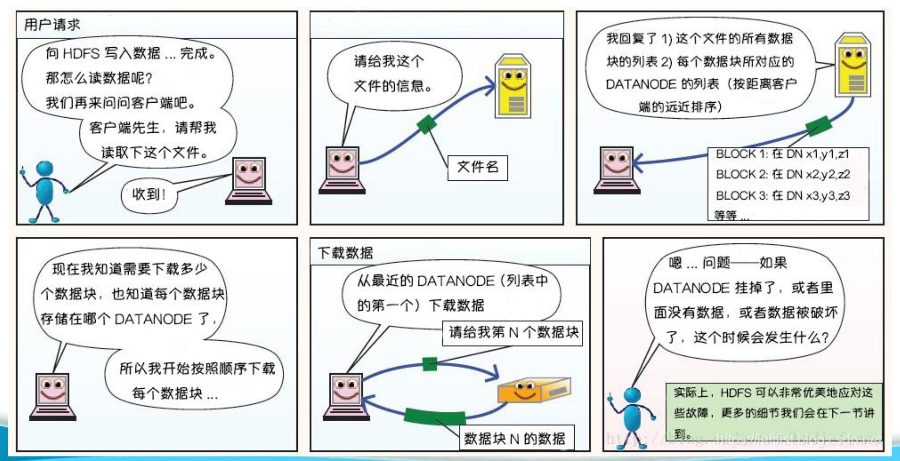

# HDFS（Hadoop Distributed File System）
>https://blog.csdn.net/weixin_44514533/article/details/102890306 HDFS 基本介绍
- node \ block \ distribution
- 干什么->解决什么->遇到什么
- HDFS和RDD的关系

## ------↓node \ block \ distribution↓------

### 1.节点（Node）
在HDFS中，节点指的是构成HDFS集群的任何一台机器。这些节点可以有以下角色：
- **NameNode**：管理文件系统的命名空间和客户端对文件的访问。它不存储实际的数据，而是存储文件系统的元数据，例如文件到块的映射、文件属性、块所在的数据节点等。
   - a.维护,管理文件系统的名字空间(元数据信息)

   - b.负责确定指定文件块到具体的DataNode节点的映射关系

   - c.维护管理DataNode上报的心跳信息
- **DataNode**：实际存储数据的节点。每个DataNode负责管理它所在机器上的存储，并与NameNode通信，报告它存储的块的状态。  
   - 文件的各个 block 的具体存储管理由 datanode 节点承担。每一个 block 都可以在多个datanode 上。Datanode 需要定时向 Namenode 汇报自己持有的 block信息。 存储多个副本.
   - `心跳`:返回结果带有namenode给该datanode的命令如复制块数据到另一台机器，或删除某个数据块。如果超过10分钟没有收到某个datanode的心跳，则认为该节点不可用。

### 2.块（Block）
- HDFS将文件分割成一系列的块，默认情况下每个块的大小为128MB
  - 这个大小可以根据需要配置
  - 128只是个数字，数据超过128M，便进行切分，如果没有超过128M，就不用切分，有多少算多少，不足128M的也是一个快。这个快的大小就是100M）。
- 每个块可以独立地在集群中的不同DataNode上存储多个副本，以提供容错能力。块是HDFS中数据存储和复制的基本单位。

### 3.数据分布（Distribution）
- **数据复制**：为了提高数据的可靠性和可用性，每个块会有多个副本（默认是3个）。HDFS会尝试将这些副本分布在不同的节点上，以防止单点故障。
- **数据平衡**：HDFS会监控集群中的数据分布，并在需要时自动重新平衡数据，以确保集群中的数据均匀分布，避免某些节点过载。
- **数据放置策略**：HDFS使用特定的策略来决定块的存储位置。例如，第一个副本通常存储在写入数据的客户端所在的节点，后续的副本会存储在不同的节点上，以优化网络带宽的使用。

## -----↓干什么->解决什么->遇到什么↓-----
### 1. HDFS的用途
- **大规模数据存储**：HDFS设计用于存储大规模数据集，能够处理TB级甚至PB级的数据。它通过分布式存储的方式，将数据分散到多个节点上，从而实现高容量的存储。
- **高容错性**：HDFS具有高容错性，通过在多个节点上存储数据的多个副本（默认3个副本），即使某些节点发生故障，数据也不会丢失，保证了数据的可靠性和可用性。
- **高吞吐量**：HDFS优化了数据的读写操作，能够提供高吞吐量的数据访问，适合大规模数据的批量处理和分析。
- **支持多种计算框架**：HDFS是Hadoop生态系统的核心组件，能够与MapReduce、Spark、Hive等计算框架无缝集成，为大数据处理提供了强大的存储支持。
- **可扩展性**：HDFS具有良好的水平扩展性，可以通过增加节点来扩展存储容量和计算能力，适合动态增长的数据存储需求。

### HDFS读写流程
- Master主节点（NameNode）管理文件系统所有的元数据，为所有文件和目录提供一个树状结构的元数据信息；
- 实现客户端文件的操作控制和存储任务的管理分配，即它也决定着数据块到DataNode的映射。
- Client是需要获取分布式文件系统的应用程序。

#### (1) HDFS文件写入

     ① Client向NameNode发起文件写入的请求；
     ② NameNode根据文件大小和文件块配置情况，返回给Client它所管理部分DataNode的信息；
     ③ Client将文件划分为多个文件块，根据DataNode的地址信息，按顺序写入到每一个DataNode块中。

#### (2)HDFS文件读取

    ① Client向NameNode发起文件读取的请求；
    ② NameNode返回文件存储的DataNode的信息；
    ③ Client读取文件信息。

### 2. HDFS解决的问题
- **大规模数据存储问题**：传统的文件系统在处理大规模数据时会面临存储容量和性能瓶颈。HDFS通过分布式存储的方式，将数据分散到多个节点上，解决了大规模数据存储的问题。
- **数据可靠性问题**：在分布式系统中，节点故障是常见的问题。HDFS通过数据冗余（默认3个副本）的方式，确保即使某些节点发生故障，数据仍然可以完整恢复，提高了数据的可靠性。
- **高吞吐量数据访问问题**：HDFS优化了数据的读写操作，能够提供高吞吐量的数据访问，适合大规模数据的批量处理和分析，解决了传统文件系统在高吞吐量场景下的性能瓶颈。
- **数据一致性问题**：HDFS通过严格的写入和读取机制，确保数据的一致性。例如，写入数据时，只有所有副本都成功写入后，才会确认写入成功，避免了数据不一致的问题。
- **可扩展性问题**：HDFS支持动态扩展，可以通过增加节点来扩展存储容量和计算能力，解决了传统文件系统在扩展性方面的限制。

### 3. HDFS遇到的问题
- **性能瓶颈**：
  - **元数据管理**：HDFS的元数据（如文件系统树、文件和目录的属性等）存储在NameNode的内存中。随着数据量的增加，元数据的大小也会增加，可能导致NameNode的内存不足，影响性能。
  - **小文件问题**：HDFS在处理大量小文件时效率较低。每个文件的元数据都会占用NameNode的内存，大量小文件会导致NameNode的内存压力增大，影响系统的性能。
- **容错性问题**：
  - **NameNode单点故障**：虽然HDFS可以通过设置备用NameNode来提高容错性，但在某些情况下，NameNode仍然是单点故障的潜在风险。如果NameNode发生故障，整个文件系统可能会不可用。
  - **数据副本一致性**：在分布式系统中，数据副本的一致性是一个复杂的问题。虽然HDFS通过心跳机制和数据校验来确保副本的一致性，但在某些故障场景下，仍然可能会出现数据不一致的情况。
- **运维复杂性**：
  - **集群管理**：HDFS集群的部署和管理需要一定的技术知识和经验。需要进行集群配置、监控、备份、故障恢复等一系列运维工作。
  - **性能调优**：HDFS的性能调优较为复杂，需要根据具体的业务需求和数据特点进行配置和优化。例如，调整块大小、副本数量、内存分配等参数。
- **安全性问题**：
  - **权限管理**：HDFS的权限管理相对简单，主要基于文件和目录的权限设置。在复杂的多用户环境中，可能需要更细粒度的权限管理。
  - **数据加密**：虽然HDFS支持数据加密，但在实际应用中，数据加密和解密的性能开销较大，可能会影响系统的性能。
- **生态系统兼容性**：
  - **与传统系统的集成**：HDFS与传统的关系型数据库和文件系统集成较为复杂，需要额外的适配和转换工具。
  - **与其他大数据工具的兼容性**：虽然HDFS是Hadoop生态系统的核心组件，但在与其他大数据工具（如Spark、Flink等）集成时，可能会遇到一些兼容性问题。

### 总结
HDFS作为一种分布式文件系统，解决了大规模数据存储、数据可靠性、高吞吐量数据访问、数据一致性和可扩展性等问题，为大数据处理提供了强大的存储支持。然而，HDFS在性能、容错性、运维复杂性、安全性和生态系统兼容性等方面也面临一些挑战。这些问题需要通过技术改进和优化来解决，以更好地满足大数据处理的需求。

## -----↓HDFS和RDD的关系↓-----
- `数据存储`：HDFS可以作为RDD数据的存储系统。Spark可以从HDFS中读取数据来创建RDD，也可以将RDD中的数据写回到HDFS中。
- `数据处理`：RDD提供了对数据进行复杂处理的能力，而HDFS提供了一个可靠的存储系统来保存这些数据。两者结合，使得Spark能够在HDFS上高效地进行大规模数据处理。
- `容错性`：HDFS通过数据复制提供了存储层的容错性，而RDD通过血统信息提供了计算层的容错性。这种双层容错机制确保了数据处理的可靠性。
- `性能优化`：由于RDD支持数据的持久化（caching），Spark可以优化数据访问模式，将数据缓存在内存中，减少对HDFS的读取次数，从而提高数据处理性能。