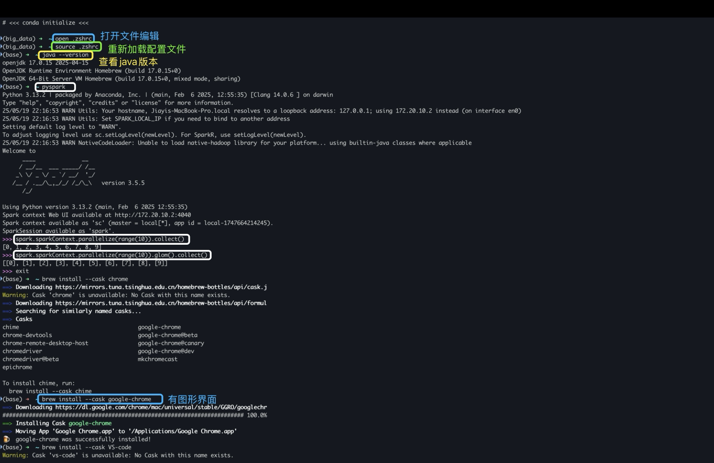

# Table of contents
- 一、用conda创建虚拟环境

- 二、macOS系统中使用Vscode中matplotlib中文字体乱码问题

- 三、终端命令 macOS

- 四、终端命令-图例（包含：启动pyspark和用brew下载东西）

ps:

cd /opt --> 这个 “/” 是指根目录

cd .. --> 返回上一级文件夹下

## 一、用conda创建虚拟环境

`创建虚拟环境`
conda create -n your_env_name python=x.x

`激活新创建的虚拟环境`
conda activate your_env_name

`退出当前虚拟环境`
conda deactivate

`删除当前虚拟环境`
conda env remove -n your_env_name

`查看所有虚拟环境`
conda info --envs **（带有*的是当前激活的环境）**

`查看某个虚拟环境中的安装包`
conda list **(要先激活虚拟环境)**

## 二、macOS系统中使用Vscode中matplotlib中文字体乱码问题
整体复制粘贴

    import matplotlib.pyplot as plt
    import matplotlib
    matplotlib.rcParams['font.family'] = 'Arial Unicode MS'  # 指定支持中文的字体
    matplotlib.rcParams['font.size'] = 12
    matplotlib.rcParams['axes.unicode_minus'] = False  # 正确显示负号

## 三、终端命令 macOS

#### 1.文件和目录操作

- `ls`：列出目录内容。
- `cd`：更改当前目录。
- `pwd`：打印当前工作目录的路径。
- `mkdir`：创建新目录。
- `rmdir`：删除空目录。
- `touch`：创建新文件或更新现有文件的时间戳。
- `cp`：复制文件或目录。
- `mv`：移动或重命名文件或目录。
- `rm`：删除文件或目录。
- `cat`：查看文件内容。
- `nano` 或 `vim`：文本编辑器，用于编辑文件。
- `open`打开文件编辑。

#### 2.文件系统操作

- `df`：显示文件系统的磁盘空间使用情况。
- `du`：估计文件或目录的磁盘空间使用量。

#### 3.权限管理

- `chmod`：更改文件或目录的权限。
- `chown`：更改文件或目录的所有者。
- `chgrp`：更改文件或目录的组。

#### 4.网络操作

- `ping`：测试主机之间的网络连通性。
- `curl` 或 `wget`：从网络上下载文件。
- `ifconfig` 或 `ip`：查看或配置网络接口。

#### 5.系统信息

- `uname`：显示系统信息。
- `uptime`：显示系统运行时间。
- `top` 或 `htop`：显示系统中运行的进程。
- `ps`：显示当前进程的状态。
- `kill`：终止进程。

#### 6.包管理

- `brew`：Homebrew 是 macOS 上的包管理器，用于安装软件包。
  - `brew install package_name`：安装软件包。
  - `brew list`：列出已安装的软件包。
  - `brew update`：更新 Homebrew 并同步本地数据库。

#### 7.其他

- `alias`：创建命令别名。
- `history`：显示命令历史记录。
- `clear`：清除终端屏幕。

macOS 终端支持的命令非常多，可以通过 `man` 命令查看命令的手册页来获取更多信息，例如 `man ls` 会显示 `ls` 命令的手册页。

#### 四、终端命令-图例（包含：启动pyspark和用brew下载东西）

