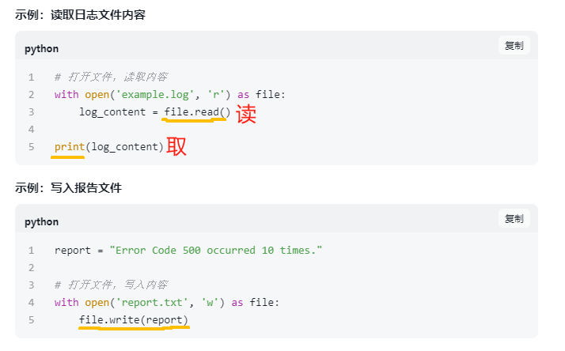
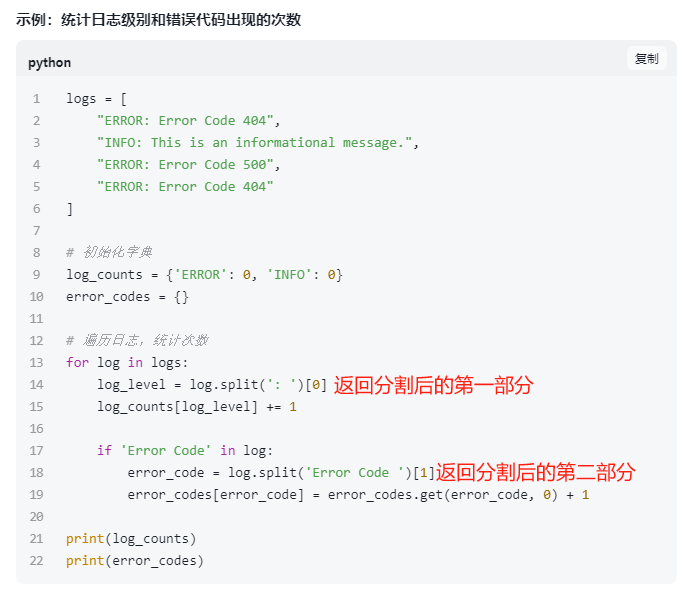
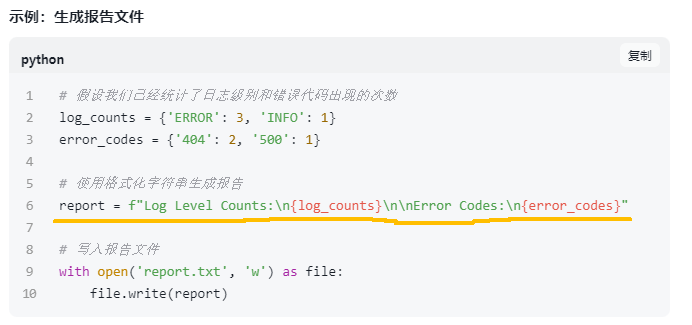
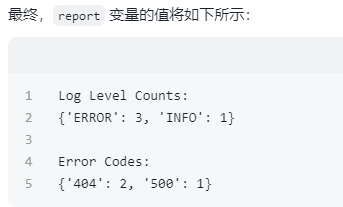

### **题目：日志文件分析与报告生成**
**任务:** 编写一个程序，完成以下任务：
1. 从一个日志文件中读取内容，日志文件的每一行包含一个日志条目，格式如下：
   ```
   [时间戳] [日志级别] [消息内容]
   ```
   例如：
   ```
   [2025-03-15 10:00:00] [INFO] This is an info message.
   [2025-03-15 10:01:00] [ERROR] This is an error message.
   ```
2. 统计每种日志级别（如`INFO`、`ERROR`等）出现的次数。
3. 找出所有`ERROR`级别的日志条目，并将它们保存到一个新的文件中。
4. 生成一个报告文件，包含以下内容：
   - 每种日志级别出现的次数。
   - 所有`ERROR`级别的日志条目。
   - 每个`ERROR`条目的详细信息，包括时间戳、日志级别和消息内容。
5. 打印统计结果和`ERROR`日志条目的数量。
6. 解析日志消息中的特定模式（如错误代码），并统计这些模式的出现次数。例如，假设日志消息中包含错误代码`[ErrorCode: 123]`，统计每个错误代码的出现次数。

**示例：**
假设日志文件`log.txt`内容如下：
```
[2025-03-15 10:00:00] [INFO] This is an info message.
[2025-03-15 10:01:00] [ERROR] This is an error message. [ErrorCode: 404]
[2025-03-15 10:02:00] [INFO] Another info message.
[2025-03-15 10:03:00] [ERROR] Another error message. [ErrorCode: 500]
[2025-03-15 10:04:00] [ERROR] Yet another error message. [ErrorCode: 404]
```
程序执行后，输出：
```
INFO: 2
ERROR: 3
ERROR log entries saved to error_log.txt
Report saved to report.txt
```
并且生成两个文件：
- `error_log.txt`，内容为：
  ```
  [2025-03-15 10:01:00] [ERROR] This is an error message. [ErrorCode: 404]
  [2025-03-15 10:03:00] [ERROR] Another error message. [ErrorCode: 500]
  [2025-03-15 10:04:00] [ERROR] Yet another error message. [ErrorCode: 404]
  ```
- `report.txt`，内容为：
  ```
  Log Analysis Report

  Log Level Counts:
  INFO: 2
  ERROR: 3

  ERROR Log Entries:
  [2025-03-15 10:01:00] [ERROR] This is an error message. [ErrorCode: 404]
  [2025-03-15 10:03:00] [ERROR] Another error message. [ErrorCode: 500]
  [2025-03-15 10:04:00] [ERROR] Yet another error message. [ErrorCode: 404]

  Error Code Counts:
  404: 2
  500: 1
  ```

**提示：**
- 使用文件操作读取和写入文件。
- 使用字符串分割和切片提取日志级别和消息内容。
- 使用字典统计日志级别和错误代码出现的次数。
- 使用正则表达式解析日志消息中的特定模式（如错误代码）。
- 使用格式化字符串生成报告文件。

**作答：**
```python
import re
from collections import defaultdict

# 定义文件路径
log_path = r"C:\Users\86137\Desktop\bigdata_project\02\log.log" 
error_log_path = r"C:\Users\86137\Desktop\bigdata_project\02\error_log.txt"
report_path = r"C:\Users\86137\Desktop\bigdata_project\02\report.txt"

# 初始化变量
log_levels_count = defaultdict(int)
error_logs = []
error_codes_count = defaultdict(int)

# 正则表达式匹配日志条目
log_pattern = re.compile(r"(\d{4}-\d{2}-\d{2} \d{2}:\d{2}:\d{2}), (\w+)\s+(\S.*)")             

# 读取日志文件并解析内容
try:
    with open(log_path, 'r', encoding='utf-8') as file:
        for line in file:
            match = log_pattern.match(line.strip())
            if match:
                timestamp, log_level, message = match.groups()

                # 统计日志级别出现次数
                log_levels_count[log_level] += 1

                # 如果是 ERROR 级别，保存到 error_logs 并解析错误代码
                if log_level == "Error":  
                    error_logs.append(line.strip())
                    # 查找错误代码 [ErrorCode: XXX]
                    error_code_match = re.search(r"$ErrorCode: (\d+)$", message)
                    if error_code_match:
                        error_code = error_code_match.group(1)
                        error_codes_count[error_code] += 1
except FileNotFoundError:
    print(f"Error: Log file not found at {log_path}")
    exit(1)

# 将所有 ERROR 日志写入新文件
with open(error_log_path, 'w', encoding='utf-8') as error_file:
    for error_log in error_logs:
        error_file.write(error_log + "\n")

# 生成报告文件
with open(report_path, 'w', encoding='utf-8') as report_file:
    report_file.write("Log Analysis Report\n\n")
    report_file.write("Log Level Counts:\n")
    for level, count in log_levels_count.items():
        report_file.write(f"{level}: {count}\n")
    
    report_file.write("\nERROR Log Entries:\n")
    for error_log in error_logs:
        report_file.write(error_log + "\n")
    
    report_file.write("\nError Code Counts:\n")
    for code, count in error_codes_count.items():
        report_file.write(f"{code}: {count}\n")

# 打印统计结果和 ERROR 日志条目的数量
print("Info:", log_levels_count.get("Info", 0))  
print("Error:", log_levels_count.get("Error", 0))
print(f"ERROR log entries saved to {error_log_path}")
print(f"Report saved to {report_path}")
```


**笔记：**
1. 使用文件操作读取和写入文件

-打开文件 

**语法**：open(file_path, mode, encoding='utf-8', ...)

**示例**：file = open("example.txt", "r")  # 默认模式是 'r'（只读）

**分析**:

- ​**file_path**：文件路径（相对路径或绝对路径）。

- ​**mode**：文件操作模式（关键参数）。
'r'：只读（默认）。
'w'：写入（覆盖原文件）。
'a'：追加（写入到文件末尾）。
'b'：二进制模式（如 'rb', 'wb'）。
'x'：新建文件（若文件存在则报错）。
'+'：可读可写（如 'r+', 'w+'）。


2. 使用字符串分割和切片提取日志级别和消息内容


```python
log_entry = "ERROR [500] Internal Server Error occurred"

# 按空格分割两次
parts = log_entry.split(' ', 2)  
# ['ERROR', '[500]', 'Internal Server Error occurred']

level = parts[0]  # 日志级别
details = ' '.join(parts[1:])  # 合并列表中从第二个元素开始的所有元素为一个字符串，元素之间以空格分隔

#**' '.join(...)**将列表中的元素用空格 ' ' 连接成一个字符串。


print(f"日志级别: {level}")      
# 输出: ERROR
print(f"详细信息: {details}")   
 # 输出: [500] Internal Server Error occurred
```

3. 使用字典统计日志级别和错误代码出现的次数

**补充**：
```python
error_codes[error_code] = error_codes.get(error_code, 0) + 1
```
1. 这段代码是Python语言中的字典操作:统计错误代码error_code出现的次数。[这是一个常见的统计方法，用于记录和更新不同错误代码的出现次数。]
2. 下面是对这段代码的详细解析：
- error_codes 是一个字典，它的键是error_code，值是error_code出现的次数。
- error_code 是一个变量，代表一个错误代码的值。
- error_codes.get(error_code, 0) 是字典的get方法，它的作用是：

如果error_code这个键存在于字典error_codes中，则返回对应的值;

如果error_code这个键不存在于字典error_codes中，则返回默认值0。
- 1 表示每次遇到这个error_code时，其计数增加1。
- error_codes[error_code] = ... 是将计算后的新值赋给字典error_codes中对应的键error_code。

3. 这段代码的含义是：

查看`字典error_codes`中是否已经有`error_code这个键`的记录，如果有，则取出其值，并在原有基础上加1；如果没有，则从0开始计数，并加1。
最后将新的计数结果更新到`字典error_codes`中。


4. 使用正则表达式解析日志消息中的特定模式（如错误代码）

(1)  正则表达式基础：
- **字符匹配**：如`\d`匹配数字，`\w`匹配字母数字下划线，`.`匹配除换行符以外的任意字符。
- **字符集**：如`[0-9]`匹配任何单个数字，`[a-zA-Z]`匹配任何字母。
- **量词**：`+`表示一个或多个，`*`表示零个或多个，`?`表示零个或一个，`{n}`表示恰好n次。
- **定位符**：`^`匹配字符串开头，`$`匹配字符串结尾。
- **分组和捕获**：`()`用于分组，并可以捕获匹配的文本以供后续使用

（2）常用方法
- **re.search(pattern, string)**	

在字符串中搜索匹配项，返回第一个匹配对象	

示例： re.search(r'\d+', 'abc123def')
- **re.match(pattern, string)**	

从字符串开头开始匹配	

re.match(r'^\d+', '123abc')
- **re.findall(pattern, string)**

	返回所有非重叠匹配的列表	
  
示例：  re.findall(r'[aeiou]', 'hello world')
- **re.sub(pattern, repl, string)**

	替换所有匹配项	
  
示例：  re.sub(r'space', ' ', 'hello world')
- **re.compile(pattern)**	

预编译正则表达式，提高效率	

示例：pattern = re.compile(r'\d+')


5. 使用格式化字符串生成报告文件


- **f** 在字符串前缀表示这是一个格式化字符串。
- **"Log Level Counts:\n"** 是字符串的一部分，它将直接被包含在最终的字符串中。**\n** 是一个换行符，表示在输出时这里将开始新的一行。
- **{log_counts}** 是一个占位符，它将被**变量 log_counts** 的值替换。**log_counts 是一个字典**，所以当它被替换时，它将被转换为一个字符串，显示字典的键值对。
- **"\n\n"** 是两个连续的换行符，用于在报告的不同部分之间添加空行，以便于阅读。
- **"Error Codes:\n"** 同样是字符串的一部分，后面跟着一个换行符。
- **{error_codes}** 是另一个占位符，将被**变量 error_codes** 的值替换。同样，**error_codes 是一个字典**，其内容将被转换为字符串并插入到报告中。