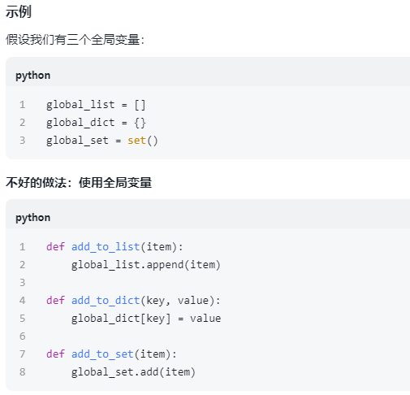
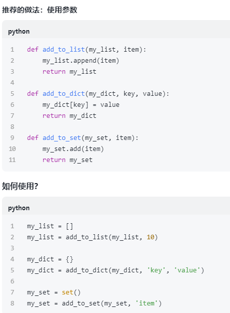

### **题目：日志文件分析与报告生成**
**任务：**编写一个程序，完成以下任务：
1. 从一个日志文件中读取内容，日志文件的每一行包含一个日志条目，格式如下：
   ```
   [时间戳] [日志级别] [消息内容]
   ```
   例如：
   ```
   [2025-03-15 10:00:00] [INFO] This is an info message.
   [2025-03-15 10:01:00] [ERROR] This is an error message.
   ```
2. 统计每种日志级别（如`INFO`、`ERROR`等）出现的次数。
3. 找出所有`ERROR`级别的日志条目，并将它们保存到一个新的文件中。
4. 生成一个报告文件，包含以下内容：
   - 每种日志级别出现的次数。
   - 所有`ERROR`级别的日志条目。
   - 每个`ERROR`条目的详细信息，包括时间戳、日志级别和消息内容。
5. 打印统计结果和`ERROR`日志条目的数量。
6. 解析日志消息中的特定模式（如错误代码），并统计这些模式的出现次数。例如，假设日志消息中包含错误代码`[ErrorCode: 123]`，统计每个错误代码的出现次数。

**示例：**
假设日志文件`log.txt`内容如下：
```
[2025-03-15 10:00:00] [INFO] This is an info message.
[2025-03-15 10:01:00] [ERROR] This is an error message. [ErrorCode: 404]
[2025-03-15 10:02:00] [INFO] Another info message.
[2025-03-15 10:03:00] [ERROR] Another error message. [ErrorCode: 500]
[2025-03-15 10:04:00] [ERROR] Yet another error message. [ErrorCode: 404]
```
程序执行后，输出：
```
INFO: 2
ERROR: 3
ERROR log entries saved to error_log.txt
Report saved to report.txt
```
并且生成两个文件：
- `error_log.txt`，内容为：
  ```
  [2025-03-15 10:01:00] [ERROR] This is an error message. [ErrorCode: 404]
  [2025-03-15 10:03:00] [ERROR] Another error message. [ErrorCode: 500]
  [2025-03-15 10:04:00] [ERROR] Yet another error message. [ErrorCode: 404]
  ```
- `report.txt`，内容为：
  ```
  Log Analysis Report

  Log Level Counts:
  INFO: 2
  ERROR: 3

  ERROR Log Entries:
  [2025-03-15 10:01:00] [ERROR] This is an error message. [ErrorCode: 404]
  [2025-03-15 10:03:00] [ERROR] Another error message. [ErrorCode: 500]
  [2025-03-15 10:04:00] [ERROR] Yet another error message. [ErrorCode: 404]

  Error Code Counts:
  404: 2
  500: 1
  ```

**提示：**
- 使用文件操作读取和写入文件。
- 使用字符串分割和切片提取日志级别和消息内容。
- 使用字典统计日志级别和错误代码出现的次数。
- 使用正则表达式解析日志消息中的特定模式（如错误代码）。
- 使用格式化字符串生成报告文件。


```python
import re
from collections import defaultdict

log_path = r"C:\Users\86137\Desktop\bigdata_project\[02]python_practice2\log.txt"
error_log_path = r"C:\Users\86137\Desktop\bigdata_project\[02]python_practice2\error_log.txt"
report_path = r"C:\Users\86137\Desktop\bigdata_project\[02]python_practice2\report.txt"

log_pattern = re.compile(r"\[(\d{4}-\d{2}-\d{2} \d{6})\] \[(\w+)\] (.*)")

def process_single_line(line, log_levels_count, error_logs, error_codes_count):
    match = log_pattern.match(line.strip())
    if match:
        timestamp, log_level, message = match.groups()
        log_levels_count[log_level.upper()] += 1

        if log_level.upper() == "ERROR":
            error_logs.append(line.strip())
            error_code_match = re.search(r"\[ErrorCode (\d+)\]", message)
            if error_code_match:
                error_code = error_code_match.group(1)
                error_codes_count[error_code] += 1

def generate_error_file(error_log_path, error_logs):
    with open(error_log_path, 'w', encoding='utf-8') as error_file:
        for error_log in error_logs:
            error_file.write(error_log + "\n")

def generate_error_report(report_path, log_levels_count, error_logs, error_codes_count):
    with open(report_path, 'w', encoding='utf-8') as report_file:
        report_file.write("Log Analysis Report\n\n")
        report_file.write("Log Level Counts:\n")
        for level, count in log_levels_count.items():
            report_file.write(f"{level}: {count}\n")

        report_file.write("\nERROR Log Entries:\n")
        for error_log in error_logs:
            report_file.write(f"{error_log}\n")

        report_file.write("\nError Codes Count:\n")
        for code, count in error_codes_count.items():
            report_file.write(f"{code}: {count}\n")

def main():
    log_levels_count = defaultdict(int)
    error_logs = []
    error_codes_count = defaultdict(int)

    try:
        with open(log_path, 'r', encoding='utf-8') as file:
            for line in file:
                process_single_line(line, log_levels_count, error_logs, error_codes_count)
    except FileNotFoundError:
        print(f"Error: Log file not found at {log_path}")
        exit(1)

    generate_error_file(error_log_path, error_logs)
    generate_error_report(report_path, log_levels_count, error_logs, error_codes_count)

    print("INFO:", log_levels_count.get("INFO", 0))
    print("ERROR:", log_levels_count.get("ERROR", 0))
    print(f"ERROR log entries saved to {error_log_path}")
    print(f"Report saved to {report_path}")

if __name__ == "__main__":
    main()
```

**笔记**

### 一. what is __name__：
1. **总结**： __name__ 是一个特殊的变量，用来判断你的脚本是被直接运行还是被其他脚本引用。if __ name__ == "__main__": 是一个常用的模式，用来确保某些代码（比如测试代码或者主逻辑）只在脚本被直接运行时执行，而不会在被引用时执行。

2. **“剧本” and “主角”**：
- 假设我有一个**剧本（Python脚本）**，这个剧本里有一些**角色（函数）** 和 **情节（代码逻辑）**。当我运行这个剧本时，**Python解释器**就像是一个**导演**，它会按照剧本的内容来执行。
- 在Python中，__ name__ 就像是剧本的名字。当Python解释器运行脚本时，它会检查这个脚本是被直接运行，还是被其他脚本引用（该主角被邀请去参加别的剧本的演出）。
 
     - 直接运行脚本：当直接运行这个脚本时，Python解释器会把 __ name__ 设置为 "__main__"。这就好比这个剧本是主角剧本，它自己就是主角。

     - 被其他脚本引用：如果脚本被其他脚本引用（比如其他脚本通过 import 导入了我的脚本），那么 __ name__ 会被设置为我的脚本的名字（比如 "script"）。这就好比我的剧本被其他剧本引用，我的主角成为配角。

3. **代码中的作用**：

    if __ name__ == "__main__": 这行代码的作用就像是一个“检查点”，它会问：“这个剧本是主角剧本吗？”如果是，那么就执行 main() 函数；如果不是，就跳过 main() 函数。

4. **举个例子**：

（1） 脚本 script.py

```python
def main():
    print("Hello, I am the main script!")

if __name__ == "__main__":
    main()
```
- 直接运行 script.py：
   - Python解释器会把 __name__ 设置为 "__main__"。
   - 因为 __name__ == "__main__"，所以会执行 main() 函数。
   - 输出：Hello, I am the main script!        

（2） 被其他脚本other_script.py引用 script.py

```python
import script
```
- 导入script.py
   - 当你运行 other_script.py 时，script.py 会被导入。
   - 在这种情况下，script.py 的 __name__ 会被设置为 "script"（脚本的名字）。
   - 因为 __name__ != "__main__"，所以 script.py 中的 main() 函数不会被执行。


### 二. use parameter instead of global variable for those 3 mutable global variable（使用参数代替全局变量）
1. **什么是全局变量？**
全局变量是在函数外部定义的变量，可以在程序的任何地方被访问和修改。

2. **什么是局部变量？**
局部变量是在函数内部定义的变量，只能在该函数内部被访问和修改。

3. **为什么建议使用参数代替全局变量？**
- 避免意外修改：全局变量可以在任何地方被修改，这可能导致意外的行为和难以追踪的错误。
- 提高代码可读性：使用参数可以让函数的依赖关系更明确，使代码更易于理解和维护。
- 方便测试：使用参数的函数更容易进行单元测试，因为你可以轻松地传递不同的参数来测试函数的行为。




### 三.其他
- 可变数据类型不能作为全局变量
- 常量写了不会变
- 没有定义却存在的变量 -> 这在python中是合理的
- 将3个可变量数据类型 作为参数传参 并 定义在main函数里(不作为全局变量)-> 参考2_modify md文档