# Parallel_Search self-learning note

## Parallel_Search在讲什么？
1. 复习数据分区策略
2. 使用RDDs实现不同的搜索功能
3. 使用Spark SQL模块实现不同的搜索功能：将使用Spark API和数据框以及Spark SQL来执行与第1部分类似的搜索功能
4. 此外，还要求可视化这些API和RDD实现中的并行搜索，并查看Spark优化器引擎执行的查询执行计划，以及理解Spark如何内部执行或规划搜索功能。

## Table of Contents（5大块）
- **SparkContext and SparkSession**
- **Data Partitioning**
- **park RDDs**
    - Data Partitioning in RDD(在RDD中实现数据分区)
      >**数据分区策略：** Round-robin数据分区\\Range数据分区\\Hash数据分区。
        - Default Partitioning(默认分区)
        - Hash Partitioning(Hash分区)
        - Range Partitioning(Range分区)
            
    - Parallel Search in RDDs(在RDD中实现并行搜索)
- **Spark DataFrames**

    >**DataFrame介绍：** 创建DataFrame的方法。\\DataFrame的schema显示。\\DataFrame的方法尝试（如显示前10行、选择和过滤等）。
    - Data Partitioning in DataFrames(DataFrame中的数据分区)
    - Parallel Search in DataFrames(使用DataFrame API实现并行搜索)
    - Parallel Search with SparkSQL(使用Spark SQL实现并行搜索)

        >**Spark SQL：** Spark SQL的介绍。\\使用SQL查询DataFrame中的数据。
- **Lab Tasks**
    - Lab Task 1(比较记录并解释结果)
    - Lab Task 2(修正使用max()函数的代码以获取正确的结果)
    - Lab Task 3(为新数据集实现Range和Hash分区技术并显示分区)
    - Lab Task 4(完成给定单元格中的代码以实现给定条件)

## SparkContext和SparkSession:
**是Apache Spark编程模型中的重要组件，用于创建Spark应用程序的入口点。**

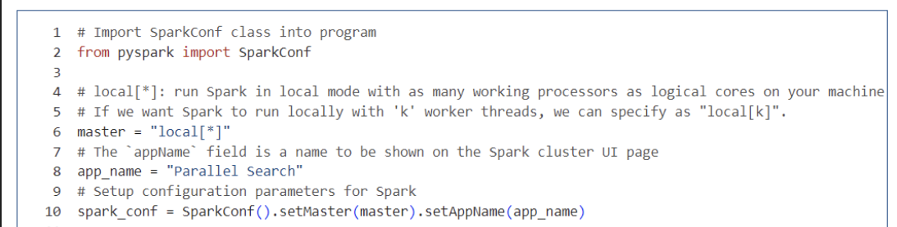
- 此部分讨论了**如何导入SparkConf类**并**设置Spark应用程序的配置**，例如master URL和应用程序名称。代码片段展示了如何使用`SparkConf`来配置Spark，并使用`SparkContext`和`SparkSession`来**创建Spark应用程序的入口点**。

- 除此之外，还包括一些**警告信息**，例如无法加载本机Hadoop库，以及SparkUI无法绑定到端口4040而尝试绑定到端口4041。

-----
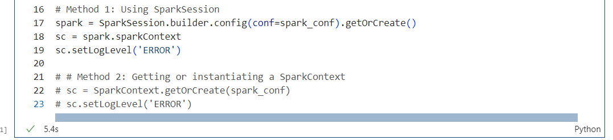

- 此处讨论了**如何配置Spark应用程序**。它提供了两种创建Spark应用程序的方法：
   >**使用SparkSession：** 
   通过SparkSession.builder.config(conf=spark_conf).getOrCreate()来创建SparkSession对象，并使用spark.sparkContext获取SparkContext对象。

   >**直接获取或实例化SparkContext：** 
   使用SparkContext.getOrCreate(spark_conf)来获取或创建SparkContext对象。
- 代码片段还展示了如何设置日志级别为ERROR，以便减少日志输出。

-----
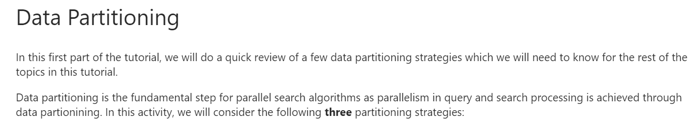
- 此处讨论了**数据分区（Data Partitioning）的概念**，这是**并行搜索算法的基础步骤**，因为它**通过数据分区实现了查询和处理中的并行性**。文档介绍了三种分区策略：

    1. `轮询数据分区`（Round-robin data partitioning）：这是最简单的数据分区方法，每个记录**依次分配给一个处理元素**（即处理器）。由于它**将数据均匀分布**在所有处理器上，因此也称为“等分区”。

    2. `范围数据分区`（Range data partitioning）：基于分区属性的**给定范围**对记录进行分区。例如，学生表可以根据“姓氏”按字母顺序（即A ~ Z）进行分区。

    3. `哈希数据分区`（Hash data partitioning）：使用**哈希函数基于特定属性**创建分区。哈希函数的结果决定了记录将被放置的处理器。因此，**同一分区内的所有记录具有相同的哈希值**。

- 此处还提到，默认情况下，**Spark使用随机等分区来对数据进行分区**，除非有特定的转换使用了不同类型的分区。

-----
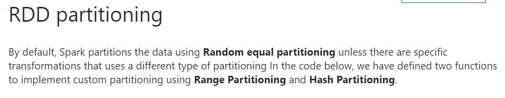
- **默认分区方式**

    - Spark 默认使用 `随机等分区`（Random equal partitioning）来对数据进行分区，除非有特定的转换使用了不同类型的分区。

- **自定义分区函数**

    - 在下面的代码中，定义了两个函数来实现自定义分区，分别是 `范围分区`（Range Partitioning）和 `哈希分区`（Hash Partitioning）。
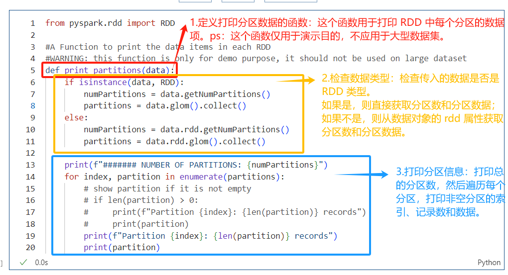
       > 总结
 
          这部分代码主要展示了如何在 PySpark 中自定义分区，并通过一个示例函数 print_partitions 来打印每个分区的数据。这对于理解和调试分区策略非常有帮助。
          
          在实际应用中，应避免在大数据集上使用此函数，因为 collect() 会将所有数据拉回到驱动程序节点，可能导致内存溢出。

    - 下图代码用于演示数据分区的示例。
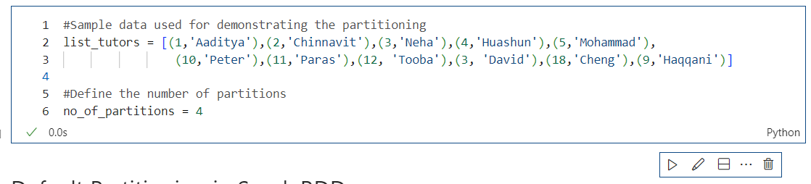

   1. 第二行`定义了一个列表 list_tutors`，其中**包含了多个元组**，每个**元组3**. 包含一个数字和一个名字。
   2. 第六行定义了一个`变量 no_of_partitions` 并赋值为**4**，表示要**将数据分成4个分区**。
------
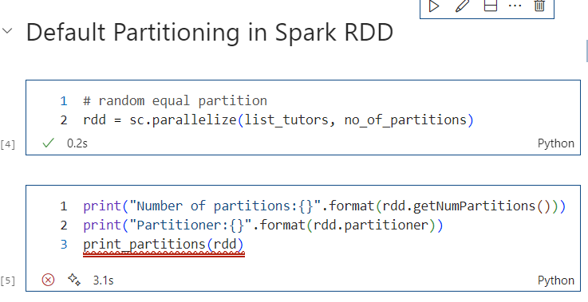
>第一代码块

`sc.parallelize(list_tutors, no_of_partitions) `是 Spark 中用来并行化集合的方法。这里将 `list_tutors `这个列表转换成一个RDD（弹性分布式数据集），并且指定了分区的数量为 `no_of_partitions`。

>第二代码块

`rdd.getNumPartitions()` 获取RDD的总分区数。
`rdd.partitioner `查看RDD的分区器信息。
`print_partitions(rdd) `可能是一个自定义函数，用于打印RDD的详细信息。

------
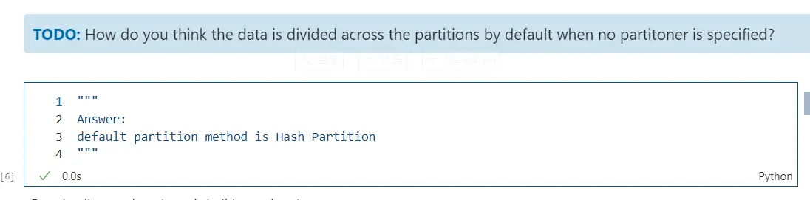
- 当未指定分区器时，您认为数据是如何被划分到各个分区中的？

    默认的分区方法是哈希分区

------
此处展示了Apache Spark 的 RDD（弹性分布式数据集）中实现`哈希分区`
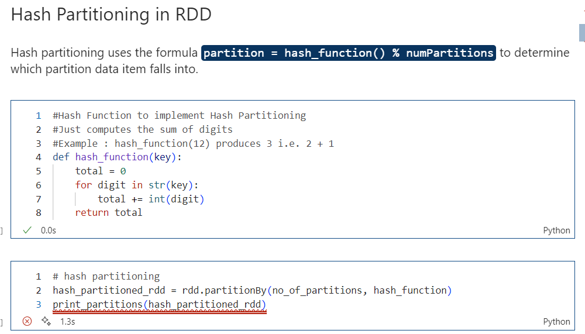
>第一代码块

这个函数 `hash_function` 用于计算键的哈希值。在这个例子中，哈希值是通过将键转换为字符串，然后逐位相加得到的。

-----
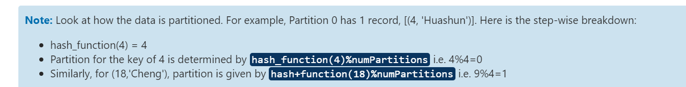

如何在Apache Spark中使用哈希函数对数据进行分区？（对上述知识点的总结）
1. **哈希函数计算:**
对于键为4的记录，首先计算其哈希值：hash_function(4)。假设这个函数返回值为4。
2. **确定分区:**
使用**哈希值**和**分区数**的**模运算**来确定该记录应该被分配到哪个分区。这里使用了4个分区 (numPartitions = 4)。
计算 hash_function(4) % numPartitions，即 4 % 4 = 0。因此，键为4的记录被分配到分区0。
3. **类似地处理其他记录:**
对于键为18的记录，同样先计算其哈希值：hash_function(18)。假设这个函数返回值为9。
然后，使用相同的模运算来确定分区：hash_function(18) % numPartitions，即 9 % 4 = 1。因此，键为18的记录被分配到分区1。
    
    ps: m % n = k (m是 键通过哈希函数 返回得到的返回值，n是 分区总数，k是 分配到哪儿一个分区)

-----
展示了如何在Apache Spark的RDD（弹性分布式数据集）中实现`范围分区`（Range Partitioning）
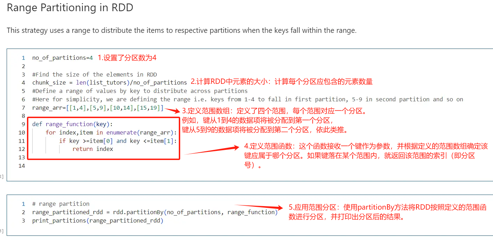

-----
展示了一个关于使用 Apache Spark 的 RDD（弹性分布式数据集）进行`并行搜索`的教程
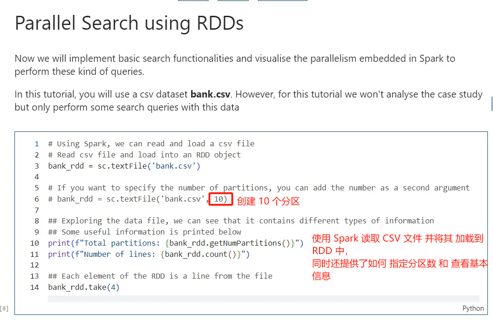

-----
展示了如何在 Apache Spark 的 RDD（弹性分布式数据集）中`基于多个条件进行搜索`
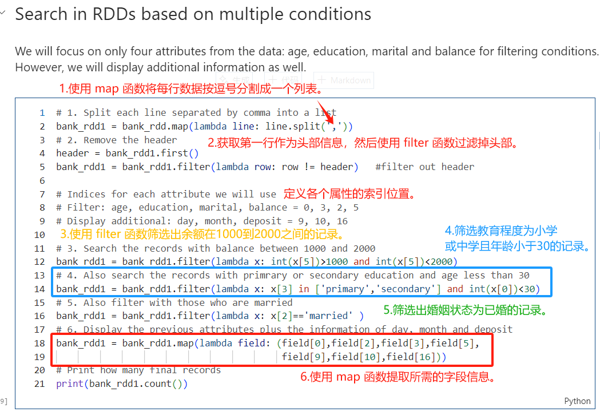
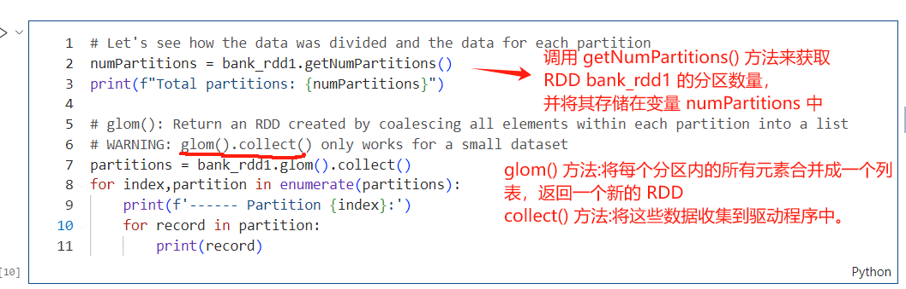

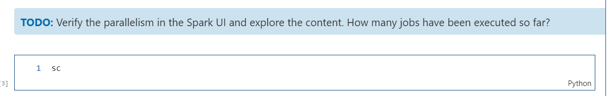

-----
展示了如何在 Apache Spark 中查找 RDD（弹性分布式数据集）中`某个属性的最大值或最小值`
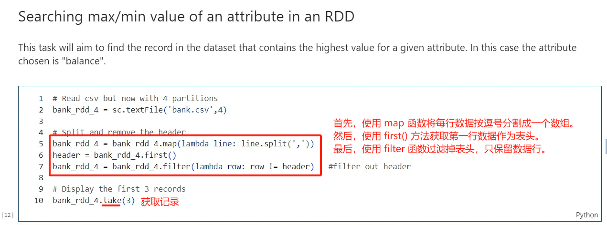
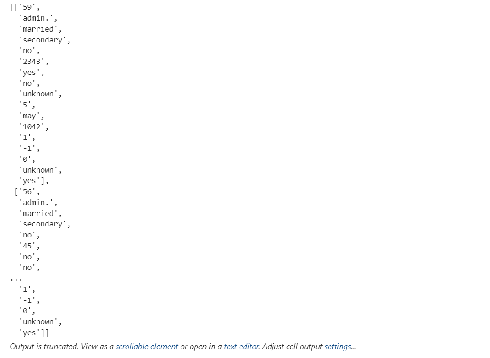
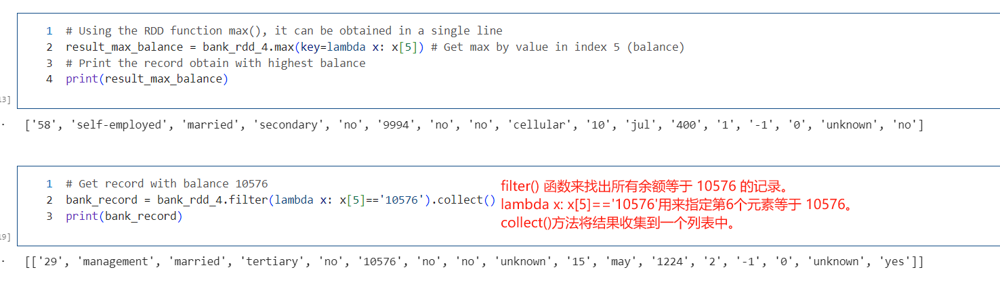

-----
**more functions in RDD**
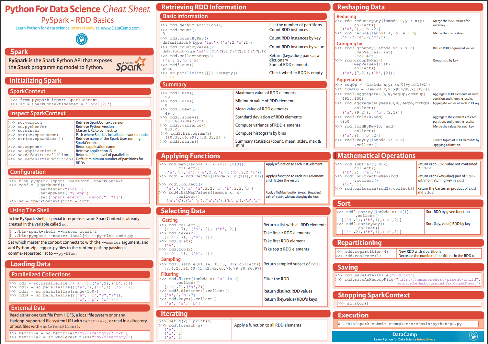

-----
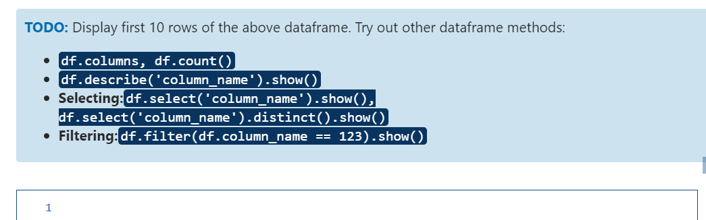
`df.columns``: 返回DataFrame的所有列名。
`df.count()`: 返回每一列的非空值的数量。
`df.describe(‘column_name’)`: 提供关于指定列的统计摘要。
`df.select(‘column_name’)`: 选择DataFrame中的一个或多个列。
`df.select(‘column_name’).distinct()`: 选择一个列并返回该列的不同值。
`df.filter(df.column_name == 123)`: 过滤出满足条件的行。
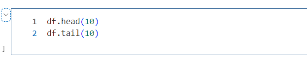

-----
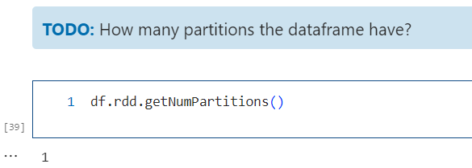

-----

