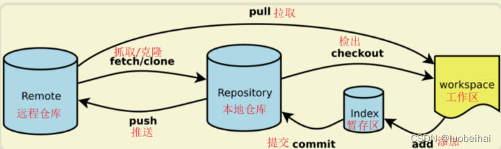
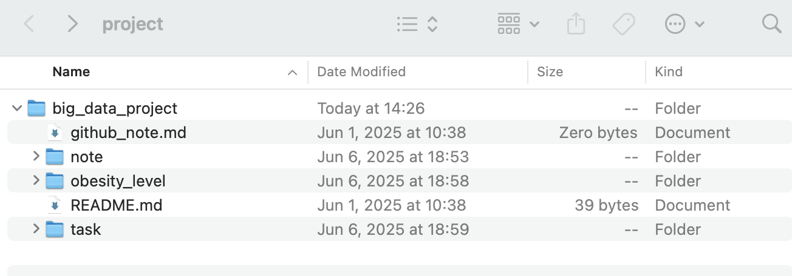
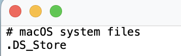
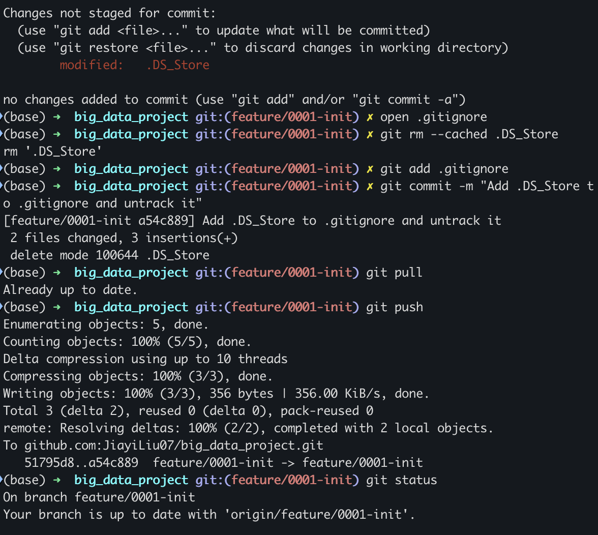

# Tables of contents
-  一、git命令
-  二、修改 README.md文件 本地同步到远程的完整流程示例
-  三、实操

## 一、git命令

`git -h`：用于显示 Git 命令的帮助信息

`git status`：显示当前工作树的状态。

`ping github.com`：检查网络是否通信

`git clone https://github.com/JiayiLiu07/big_data_project.git`:克隆 远程的项目

`git branch`:显示所有本地分支，当前分支前会有一个星号（*）标记。!

`git pull`:用于从远程仓库获取（fetch）并合并（merge）当前分支的最新内容。（远程到本地）

`git push`:用于将本地仓库的更新推送到远程仓库。（本地到远程）

`git checkout xxx`：切换到xxx（其他)分支

## 二、修改 README.md文件 本地同步到远程的完整流程示例：
1. `vim README.md`：修改 README.md文件】
2. `git add`：【添加所有修改】将工作区的修改添加到暂存区的命令。
3. `git status`：【查看状态（确认已添加）】
4. `git commit`：【提交】用于永久保存代码变更的核心命令。它的作用是将当前工作目录中的修改（已通过 git add 添加到暂存区）记录到本地仓库，并附带一个描述性的提交信息（commit message），以便后续追踪历史。（仅保存到本地仓库）
5. `git push`：【git push】

## 三、实操

### 1. 上传本地文件到github

#### 总结：git add -> git commit -> git pull -> git push

##### 如果我某天忘记： 用 command+空格 输入 project:上传的入口在 project 的 big_data_project 里

1. 将我要上传的文件拖到 big_data_project 里面
2. 在终端 输入 git statue 可以查看 当前分支下的状态 : ✗ 符号通常表示工作区有变动
3. 将文件添加到暂存区 : git add 指定文件夹名字 或者 git add . 
4. 提交更改到本地仓库 : git commit -m 或者 git commit  
    - git log ：会看到一系列的提交记录包括**提交信息**
    - git commit -m "Add initial Jupyter notebooks for data analysis" ：-m 是 message（消息）的缩写
    - git commit ：会 打开一个文本编辑器 --> 在编辑器中显示一个模板，让我输入提交信息 --> 等保存并关闭编辑器后，Git 才会使用输入的信息进行提交
5. 拉取远程仓库的最新更改 : git pull
6. 推送更改到 GitHub : git push

### 2. 删除已经上传到github的某一个文件夹
1. 使用 git rm 删除文件夹 
    
    -  -r 递归删除文件夹

    - git rm -r data_folder/

2. 提交删除操作

    -  git commit -m "Remove old folder as it's no longer needed"

3. 拉取远程仓库的最新更改

    - git pull 
4. 推送更改到 GitHub

    - git push

### 3. 将 .DS_Store 从 Git 跟踪中移除并忽略它

步骤一：

将 .DS_Store 添加到 .gitignore 文件，在 .gitignore 文件中添加忽略规则

步骤二：

从 Git 跟踪中移除 .DS_Store 文件

    git rm --cached .DS_Store

    --cached ：表示只从 Git 的索引中移除文件，但不会删除本地文件系统中的实际文件。
提交这些更改：
   
    git add .gitignore
    
    git commit -m "Add .DS_Store to .gitignore and untrack it"
推送到远程仓库：
    
    git pull origin feature/0001-init

    git push origin feature/0001-init

完整版：

