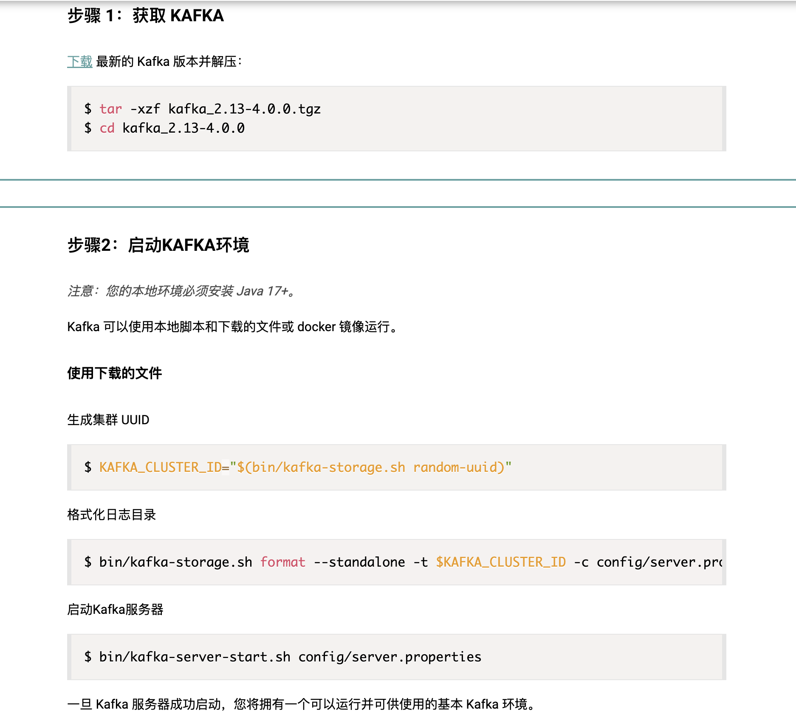
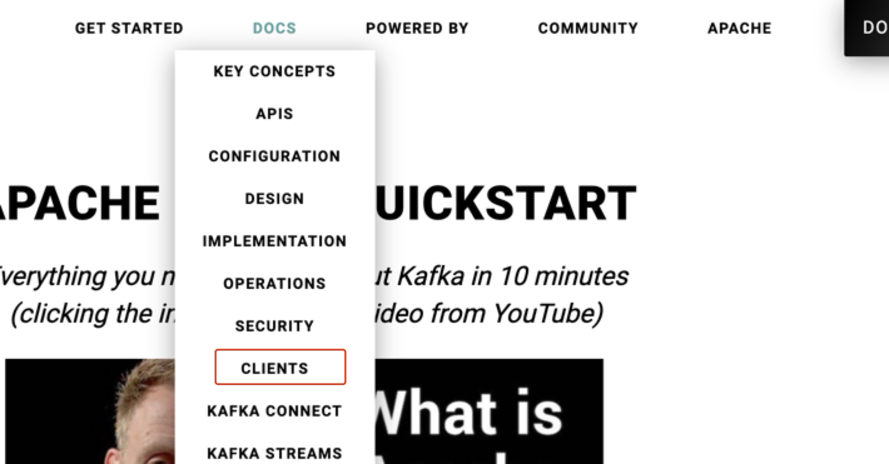

# 目录
### 一、 概念
#### （一） kafka的主要功能是
`发布和订阅流式记录` / `存储流式记录` / `销峰` [前两个最重要]
#### （二） 特性
#### 1. kafka 解决远程通信问题 
#### 2. kafka **就是一个服务** ，占据一个端口 
#### 3. kafka一般不会安装在本地 
#### 4. kafka依赖内存和硬盘（落盘：持久性）
#### 5. C发送方， O是中间键， S接送方
##### （1）同步发送和异步发送 
##### （2）中间键 [关系型数据库 / topic]
#### 6. kafka里边怎么存数据 --> `两台电脑、一个 Topic、两个分区、两个副本、三个生产者(C1\C2\C3)、两个消费者`

### 二、 代码
https://kafka.apache.org/

#### （一） QUICKSTART
#### （二） CLIENT 

# 一、 概念

【ps：当问到某个组件等其他东东的概念时，先描述其功能再延伸到他的特点/特性】

## （一） kafka的主要功能是：
（详情跳转 **[note07]kafka.md**）
- `发布和订阅流式记录`
- `存储流式记录`
    - kafka适合处理流式数据，流失数据就像水龙头流的水源源不断 --> 可以拆解为一小碗一小碗的水

- `销峰` 【不是最主要】
    - 缓冲作用
    - 秒杀场景
        - 抢票：某天珠海海洋王国有300张票
        - 抢票时间一到 有10万条请求数据涌入服务器：像水龙头的水冲入kafka里
        - 这些数据是放在topic里，可以是同一个topic，也可以是不同的
            - topic按发送的顺序排列，不会重新排序，消费者按照谁先进的顺序先拉取谁（重新排序的是传统数据库）
        - 服务器从kafka里取数据，取多少条数据取决于服务器能一次处理多少条数据

    - ps：如果是关系型数据库，而不是topic，那就会非常非常慢，因为要每有一次数据进入，就需要按照主键重新排序。 

## （二） 特性：

### 1. kafka 解决远程通信问题 
   - 通信问题属于 **计算机网络** 的知识点

### 2. kafka **就是一个服务** ，占据一个端口 
   - 服务： 提供服务的进程，一个进程占据一个端口
   - spark 本身也是个服务
   - 队列就是服务

### 3. kafka一般不会安装在本地 
- 产品是面对大众服务的 所以不会部署在本地啦

### 4. kafka依赖内存和硬盘（落盘：持久性）
- 从数据存储角度来看：进程要是挂了，内存会释放、丢失

-----
### 5. C发送方， O是中间键， S接送方
C：专门发送信息

S：是个数据库，用于存储

生产-消费 ：producer - consumer  
发布-订阅 ：publisher - subscriber

kafka是中间键，生产者把生成的数据放在kafka，消费者从kafka提取数据

#### （1）同步发送和异步发送 （操作系统里的进程通信，不是只有kafka有这东东）

**同步发送（通信）**：C要知道S收到信息，才会再发送下一条信息给S
- 老师给我发信息，等我回复了信息，老师才会发送下一条信息给我
- 如果 C 一直在等 S 的回复， C端口就一直被占用（被浪费）
- 同步的情况下：中间键也会有反馈

**异步发送（通信）**：C不用知道S是否接收到信息，就一直发
- 老师不管我是否回复他，自顾自的给我发信息
- 异步通信：销峰（秒杀场景）--> 缓冲作用

#### （2）中间键
1） 中间键是个组件，叫队列

2）关系型数据库慢是因为它是有序的
- 根据主键排序，所以有序

3）topic

- topic创建时无大小，只有存储数据越多时，表就会越大

- 按照 插入时间/插入顺序 排序：快（反馈的也会快），但是浪费硬盘空间 （ps：kafka吞吐量大）

- 一个topic对应一张表，一张表在分布式架构下对应多个 节点/电脑（存储资源）： 【N1】【N2】【N3】【N4】 （想象4个框框）

    - topic中两种存储数据情况：
         - 备份：【N1】能完全存储下一条数据，则该条数据的备份存在【N2】
         
         - 有一条数据分为a,b两段：【N1】存不下，则a在【N1】，b在【N2】，a'在【N3】，b'在【N4】。（a‘和b’分别代表a，b备份）

    - 集群：高可用性 --> 不容易丢失数据，有备份（N1/电脑1坏了，数据就丢了[因为硬盘也坏了，那么数据就释放、丢失]）

 

- 高聚合，低耦合（解耦）：把同类消息聚到一个 Topic（高聚合），把不同业务用不同 Topic 隔离（低耦合）
   - 描述同一件事的消息属于 同一业务

-----
### 6. kafka里边怎么存数据

- topic是由很多个的，每一个topic里有很多个partition
   
- kafka依赖zookeeper：当leader挂了，zookeeper负责选新的leader
    - 新的leader从一大群worker中选取，这个新的leader原来的工作也要做
    - 现在逐渐不依赖了，因为多一份组件意味着多一份依赖，容易出问题

- 网关：接入kafka的入口    (此处没理解)

`两台电脑、一个 Topic、两个分区、两个副本、三个生产者(C1\C2\C3)、两个消费者`
    
    1.  P0、P1 = Topic 的两个分区（Partition-0、Partition-1）。

    2.  每个分区各有一个 leader，所以这里共有两个 leader：
 
        • P0 leader → 192.168.0.10:9092 电脑-1 

        • P1 leader → 192.168.0.11:9092 电脑-2

    3. 生产者(C1\C2\C3)  根据  ip:port（门牌号） 连接对应的  leader（该分区唯一的写入口）

        • C1、C3 把消息发到 192.168.0.10:9092（P0 leader），

        • C2 把消息发到 192.168.0.11:9092（P1 leader）。
         
        - 客户端拿着 ip:port 直接找到那台当 leader 的电脑，把消息写进去；

        - 那台电脑（leader）再把同样的数据分发给同分区的 follower，完成备份。

        -  Kafka 按 key 做 hash 或轮询 决定消息去哪个分区，而 不同分区 leader 在不同机器

            - C1、C3 的消息 key 经过 hash 后落到 Partition-0，而 P0 的 leader 正好是 192.168.0.10:9092，于是它们直接往这个地址发

    4. 备份：leader 写完立即把数据复制给同分区的 follower（另一台电脑），消息同时在两台电脑落盘。

    5. 消费者也只跟 leader 拉消息；若某台电脑宕机，对应分区的 leader 立即漂到另一台电脑，客户端无感切换，数据不丢。

        - 客户端（生产/消费）永远只跟「当前分区的 leader ip:port」对话；leader 写完本地再把消息同步给 follower，实现两台电脑互为备份

- partition的尺寸是动态的（它在磁盘里占了多少就是它的大小）
- 重讲： 有一坨学生数据，怼到kafka --> 按性别分区（分区策略）--> kafka自动地将不同分区放到不同节点（男生在P1被放到【N1】，女生在P2被放到【N2】）--> 后面再有新的学生数据，也会如上所述：男生在P1被放到【N1】，女生在P2被放到【N2】 --> 然后因为高可用性，同时备份

# 二、 代码
【如何使用官网中的文档】
https://kafka.apache.org/

## （一） **QUICKSTART**

不知道从哪儿下手，一般先看 `QUICKSTART`

启动Kafka环境

## （二） **CLIENT**

1） kafka服务方，我们是使用方，所以在网页里找 `Client` 类似选项

2） 选包：选支持版本多的这一个包 --> 先看Readme

3 ） **离线数据 vs 实时数据**

    离线数据：从数据库读取数据，然后执行一系列操作直到结束

    实时数据：永远在运行的进程

4 ）在把数据推到kafka前（发送数据），我们一直在监听topic  --> 只有先监听，再发送数据，才能实现数据的拉取

- 此处的监听指：消费者拉取数据
     - 不是此前我理解的那个监听：时刻关注某个服务的状态